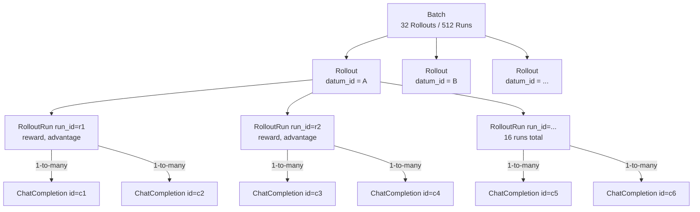
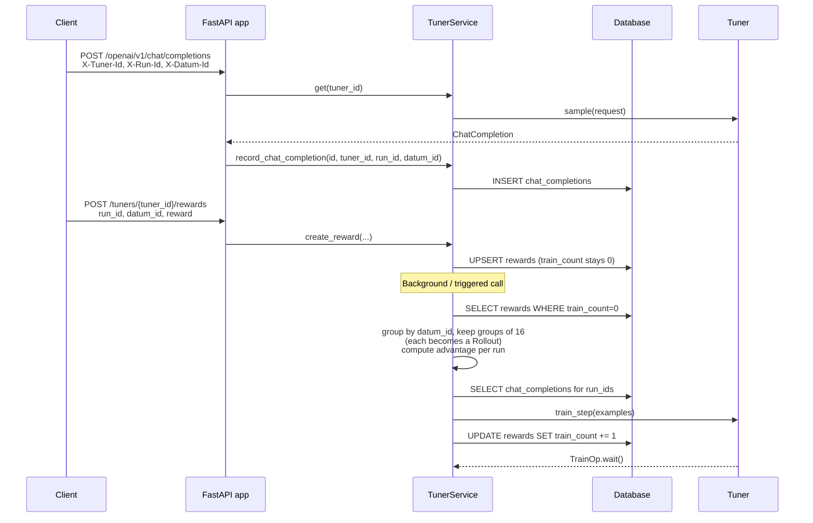

# Data Model: Rollout / Reward / ChatCompletion

This reference explains the core data-modeling concepts used by the Ollie RL
api server, and how they map onto familiar GRPO terminology (group, batch,
advantage). Read this before working on `TunerService`, `RewardModel`,
`ChatCompletionModel`, or any rollout-collection / training-step code path.

## TL;DR

```
Batch          = N Rollouts consumed by one train_step
Rollout        = a GRPO group: K runs that share the same datum_id
Run            = one attempt at a datum_id; identified by run_id
ChatCompletion = a single LLM request/response inside a run
Reward         = scalar score attached to (tuner_id, run_id) by the client
Advantage      = per-run value derived from rewards within the same Rollout
```

Note: there is no `RolloutGroup` type. The `Rollout` Pydantic model *is*
the group. The K elements inside it are `RolloutRun`s.



## Core Entities

### Datum (`datum_id`)
A reference to a single item in the upstream dataset (e.g. one prompt, one
task). The server itself does not own the dataset; clients supply
`datum_id` via the `X-Datum-Id` header (chat completions) or in the
`CreateRewardRequest` body.

A single datum is meant to be attempted multiple times so that GRPO has a
group of comparable trajectories from which it can compute relative
advantages.

### Run (`run_id`)
A single attempt at a `datum_id` under a particular tuner. A run is the
unit that the reward is attached to. One run can contain multiple
`ChatCompletion`s (e.g. multi-turn tool-calling), but only one scalar
`reward` and one `advantage`.

Uniqueness: `(tuner_id, run_id)` is unique inside `RewardModel`.

### ChatCompletion (`ChatCompletionModel`)
The lowest-level record: one LLM request/response. Persisted in the
`chat_completions` table with `(id, tuner_id, run_id, datum_id)`.

Mental model and implementation status from `db/models.py`:

| Field           | Status            | Meaning                                                         |
|-----------------|-------------------|-----------------------------------------------------------------|
| `id`            | **ACTIVE**        | A single LLM request/response.                                  |
| `run_id`        | **ACTIVE**        | The run this completion belongs to (can contain many).          |
| `datum_id`      | **ACTIVE**        | The dataset item being attempted.                               |

### Reward (`RewardModel`)
A scalar reward written by the client for a `(tuner_id, run_id)` pair.
Holds the bookkeeping the server needs to know when a run is ready for
training:

- `reward: float | None` – the value the client posted via
  `POST /tuners/{tuner_id}/rewards`.
- `datum_id` – pinned at the first write; later writes for the same
  `run_id` must match (enforced by `TunerService.create_reward`).
- `train_count: int` – number of times the run has already been included
  in a training batch. New runs start at 0; after a batch they are bumped
  to 1.

### Rollout (the group)
`Rollout(datum_id, runs)` is the in-memory representation of a GRPO
group. It is built by `TunerService.collect_rollout_ready_for_training`
and contains the K runs that share the same `datum_id`, each with its
computed `advantage`.

```python
class RolloutRun(BaseModel):
    id: str           # run_id
    reward: float
    advantage: float

class Rollout(BaseModel):
    datum_id: str
    runs: List[RolloutRun]
```

Constants currently used:
- `GROUP_SIZE = 16` – runs needed before a `Rollout` is "ready".
- `TARGET_MAX_TRAIN_COUNT = 0` – only runs that have not been trained yet
  are eligible.

### Batch
A batch is what the trainer actually consumes in one `train_step`. Today
this is hard-coded in `TunerService.train`:

- `TARGET_GROUP_COUNT = 32` – we wait until ≥ 32 ready `Rollout`s exist,
  then take the first 32 as the batch.
- Each `Rollout` in the batch is flattened to its `RolloutRun`s; each
  run is mapped back to its `ChatCompletion` rows and emitted as an
  `Example(chat_completion_id, advantage)` for `Tuner.train_step`.
- After the trainer accepts the batch we bump `train_count` for every
  included `run_id` so the same runs are not reused.

## GRPO Concepts in this Codebase

### What is a "group" in GRPO?
GRPO (Group Relative Policy Optimization) does not need an external value
function. Instead, for each prompt it samples K candidate trajectories,
scores them, and uses their relative reward inside that **group** to
estimate an advantage:

```
advantage_i = (reward_i - mean(rewards)) / (std(rewards) + eps)
```

In this codebase:
- A group is materialized as a `Rollout` and is uniquely identified by
  `datum_id` within a tuner.
- The K runs of the group are independent `run_id`s with rewards
  attached.
- The advantage computation happens in
  `collect_rollout_ready_for_training` (with `eps = 1e-8` and a
  degenerate-std fallback that emits `advantage = 0`).

### What is a "batch"?
A batch is the collection of groups consumed by one optimizer step.
GRPO loss is computed over many `(chat_completion, advantage)` pairs at
once so that gradients are well averaged. In this codebase:

- A batch is exactly `TARGET_GROUP_COUNT` (32) ready `Rollout`s.
- Inside the trainer (`Tuner.train_step`), the flattened `Example`s of
  that batch correspond to 32 × 16 = 512 runs. Since a single run can
  contain multiple chat completions, the total number of chat completion
  examples passed to the trainer will be at least 512 (and potentially
  more if runs have multi-turn interactions).
- "Ready" means every run in the group has a non-null reward and
  `train_count == 0`. Partial groups are silently skipped until they
  fill up.

## End-to-End Request Lifecycle



## Quick Pointers to Code

- `src/ollie_rl/types.py` – `Rollout`, `RolloutRun`, request DTOs.
- `src/ollie_rl/db/models.py` – `TunerModel`, `ChatCompletionModel`,
  `RewardModel`.
- `src/ollie_rl/service/tuner_service.py` – `record_chat_completion`,
  `create_reward`, `collect_rollout_ready_for_training`, `train`. This
  is where group size, batch size, and advantage math live.
- `src/ollie_rl/cookbook/types.py` – `Example(chat_completion_id,
  advantage)`, the contract handed to `Tuner.train_step`.
- `src/ollie_rl/server/app.py` – HTTP surface: chat completion
  ingestion, reward submission, tuner creation.

## Things That Are Easy to Get Wrong

- **`run_id` vs `datum_id`.** `run_id` is one attempt; `datum_id` is the
  dataset item. A `Rollout` (group) is many `run_id`s under the same
  `datum_id`.
- **`datum_id` is sticky.** Once a reward exists for `(tuner_id, run_id)`
  the `datum_id` cannot change; `create_reward` raises `ValueError`.
- **Group readiness is exact, not minimum.** `collect_rollout_ready_for_training`
  only yields `Rollout`s whose size equals `GROUP_SIZE`; extra runs
  beyond 16 are dropped on the floor during the in-memory grouping pass.
- **`train_count` is a guard, not a counter of optimizer steps.** It is
  incremented after the trainer accepts the batch, so reused runs are
  skipped on the next call.
- **Advantage uses population std with eps.** Degenerate groups (std ≈ 0)
  fall back to `advantage = 0` instead of dividing.
- **A run can contain multiple ChatCompletions.** When building
  `Example`s every completion in the run inherits the run's advantage.
