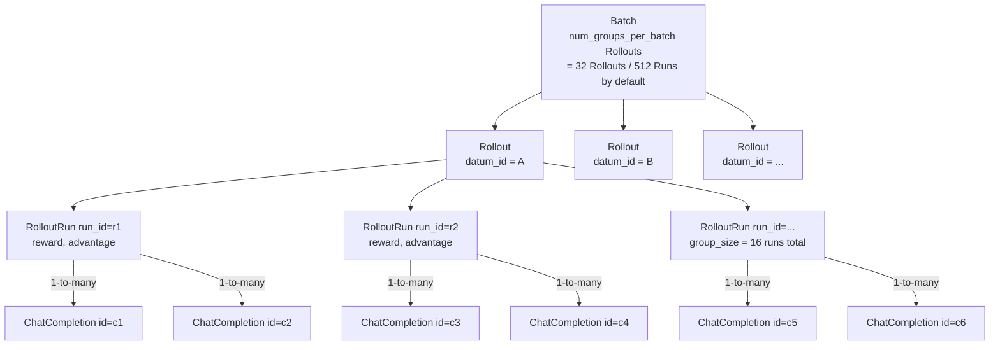
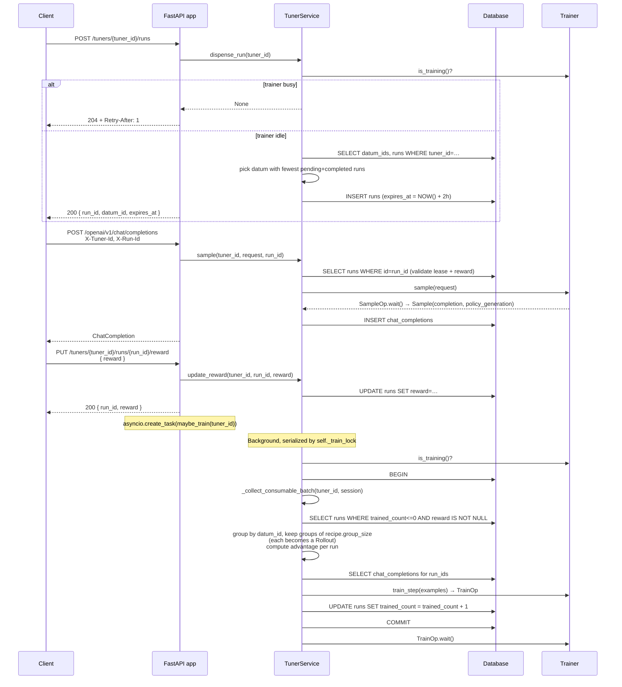

# Data Model: Rollout / Run / ChatCompletion

This reference explains the core data-modeling concepts used by the Ollie RL
api server, and how they map onto familiar GRPO terminology (group, batch,
advantage). Read this before working on `TunerService`, `RunModel`,
`ChatCompletionModel`, or any rollout-collection / training-step code path.

## TL;DR

```
Batch          = num_groups_per_batch Rollouts consumed by one train_step
Rollout        = a GRPO group: group_size runs that share the same datum_id
Run            = one attempt at a datum_id; identified by run_id (RunModel)
ChatCompletion = a single LLM request/response inside a run (ChatCompletionModel)
Reward         = scalar score attached to (tuner_id, run_id) by the client
Advantage      = per-run value derived from rewards within the same Rollout
Datum Pool     = registered list of datum_ids for a tuner (DatumRowModel)
Recipe         = declarative knobs (group_size, num_groups_per_batch, …)
```

Note: there is no `RolloutGroup` type. The `Rollout` Pydantic model *is*
the group. The K elements inside it are `RolloutRun`s.



## Core Entities

### Datum Pool (`DatumRowModel`)
A registered list of datum_ids representing the corpus/dataset for a tuner. Treat `datum_id` as opaque. Populated at `POST /tuners` creation time from the request body (`datum_ids`). A tuner is useless without a corpus, so registering it upfront is required.

### Run (`RunModel`)
A single attempt at a `datum_id` under a particular tuner. It is the canonical run record and contains the reward and training bookkeeping:

- `id` (run_id) — server-allocated unique identifier dispensed via `POST /tuners/{id}/runs`.
- `tuner_id` — the tuner this run belongs to.
- `datum_id` — the dataset item being attempted.
- `reward` — scalar float score written by the client via `PUT /reward`.
- `trained_count` — number of times the run has already been included in a training batch. New runs start at 0; after a batch they are bumped to 1, which excludes them from future batches via the `trained_count <= 0` filter in `_collect_consumable_batch`.
- `expires_at` — lease deadline for redispense (default **2 hours**, set as `now + timedelta(seconds=7200)` in `dispense_run`). If a run has `reward IS NULL` and `expires_at <= NOW()`, its lease is expired and the dispenser is free to re-dispense that `datum_id` under a fresh `run_id`.

### ChatCompletion (`ChatCompletionModel`)
The lowest-level record: one LLM request/response. Persisted in the `chat_completions` table with:

- `id` — unique completion ID (mirrors the upstream provider's `id`).
- `tuner_id` — the tuner this completion belongs to.
- `run_id` — the run this completion belongs to.
- `datum_id` — the dataset item, derived from the run record on the server (client cannot lie).
- `policy_generation` — stamped from `Sample.policy_generation` at completion-record time to track which model weight version produced the sample.

### Rollout (the group)
`Rollout(runs)` is the in-memory representation of a GRPO group. It is built by `TunerService._collect_consumable_batch` and contains the K runs that share the same `datum_id`, each with its computed `advantage`.

```python
class RolloutRun(BaseModel):
    id: str           # run_id
    reward: float
    advantage: float

class Rollout(BaseModel):
    runs: List[RolloutRun]
```

### Recipe (`Recipe` in `ollie_rl.cookbook.recipes`)
Group / batch shape is **not** hardcoded in `TunerService` — it lives on the
`Recipe` the tuner was created with, and is looked up via the `Cookbook`
registry:

- `recipe.group_size` — runs required for a `Rollout` to be "ready". Default in `GRPO_16x32`: **16**.
- `recipe.num_groups_per_batch` — number of ready Rollouts required before `_collect_consumable_batch` returns a batch. Default in `GRPO_16x32`: **32**.

To change these, register a new `Recipe(...)` constant in
`src/ollie_rl/cookbook/recipes.py` and wire it into the `RECIPES` dict in
`src/ollie_rl/cookbook/__init__.py`.

### Batch
A batch is what the trainer actually consumes in one `train_step`:

- A batch is exactly `recipe.num_groups_per_batch` (default 32) ready `Rollout`s. `_collect_consumable_batch` returns an empty batch until that threshold is met.
- Each `Rollout` in the batch is flattened to its `RolloutRun`s; each run is mapped back to its `ChatCompletion` rows and emitted as an `Example(chat_completion_id, advantage)` for `Trainer.train_step`.
- With the default recipe the batch corresponds to `32 × 16 = 512` runs. Since a single run can contain multiple chat completions, the total number of chat completion examples passed to the trainer will be at least 512 (and potentially more if runs have multi-turn interactions).
- After the trainer accepts the batch, `trained_count` is incremented for every included `run_id` so the same runs are not reused.

## GRPO Concepts in this Codebase

### What is a "group" in GRPO?
GRPO (Group Relative Policy Optimization) does not need an external value function. Instead, for each prompt it samples K candidate trajectories, scores them, and uses their relative reward inside that **group** to estimate an advantage:

```
advantage_i = (reward_i - mean(rewards)) / (std(rewards) + eps)
```

In this codebase:
- A group is materialized as a `Rollout` and is uniquely identified by `datum_id` within a tuner.
- The K runs of the group are independent `run_id`s with rewards attached.
- The advantage computation happens in `_collect_consumable_batch` with `eps = 1e-8` and a **degenerate-std fallback** that emits `advantage = 0` instead of dividing when `std <= 1e-8`.

### What is a "batch"?
A batch is the collection of groups consumed by one optimizer step. GRPO loss is computed over many `(chat_completion, advantage)` pairs at once so that gradients are well averaged. In this codebase:

- A batch is exactly `recipe.num_groups_per_batch` ready `Rollout`s.
- "Ready" means every run in the group has a non-null reward and `trained_count <= 0`. Partial groups are silently skipped until they fill up.
- Extra runs beyond `recipe.group_size` per `datum_id` are dropped on the floor during the in-memory grouping pass in `_collect_consumable_batch` (`if len(grouped_runs[reward.datum_id]) < recipe.group_size: append`).

## End-to-End Request Lifecycle



## Quick Pointers to Code

- `src/ollie_rl/types.py` — `Rollout`, `RolloutRun`, request DTOs (`CreateTunerRequest`, `DispenseRun`, `PutRewardRequest`, etc.).
- `src/ollie_rl/db/models.py` — `TunerModel`, `ChatCompletionModel`, `RunModel`, `DatumRowModel`.
- `src/ollie_rl/service/tuner_service.py` — `record_chat_completion`, `update_reward`, `_collect_consumable_batch`, `dispense_run`, `maybe_train`. This is where group size, batch size, and advantage math are applied (the *values* come from the Recipe).
- `src/ollie_rl/cookbook/recipes.py` — `Recipe` dataclass and the `GRPO_16x32` constant; declarative algorithm knobs.
- `src/ollie_rl/cookbook/__init__.py` — `Cookbook` registry that maps recipe names to `Recipe` instances.
- `src/ollie_rl/trainer/types.py` — `Trainer`, `TrainerFactory`, `StateStore`, `Op` / `SampleOp` / `TrainOp`, `Sample`, and `Example(chat_completion_id, advantage)` — the contract handed to `Trainer.train_step`.
- `src/ollie_rl/trainer/factory.py` — registry of named `TrainerFactory`s (`register`, `get`, `available`).
- `src/ollie_rl/trainer/gemini_msrl.py` — reference implementation of `Trainer` + `TrainerFactory`.
- `src/ollie_rl/server/app.py` — HTTP surface: tuner creation, run dispensing, chat completion ingestion, reward submission.

## Things That Are Easy to Get Wrong

- **`run_id` vs `datum_id`.** `run_id` is one attempt; `datum_id` is the dataset item. A `Rollout` (group) is many `run_id`s under the same `datum_id`.
- **Lease expiration vs training consumption.** `expires_at` is only used to manage the worker lease. If a worker fails to submit a reward before `expires_at`, the dispenser can re-issue the datum. However, once a run is successfully rewarded, it stays consumable for training (`trained_count <= 0`) regardless of whether `expires_at` has passed.
- **`trained_count`, not `train_count`.** The column on `RunModel` is `trained_count` (past tense). It is a guard, not a counter of optimizer steps — `_collect_consumable_batch` filters `trained_count <= 0`, and `maybe_train` bumps it by 1 after the trainer accepts the batch, so reused runs are skipped on the next call.
- **Group readiness is exact, not minimum.** `_collect_consumable_batch` only yields `Rollout`s whose size equals `recipe.group_size`; extra runs beyond `group_size` per `datum_id` are dropped during the in-memory grouping pass.
- **Group / batch shape lives on the Recipe, not in the service.** Don't hardcode `16` or `32` in `TunerService` — read them off the `Recipe` the tuner was created with.
- **Advantage uses population std with eps.** Degenerate groups (`std <= 1e-8`) fall back to `advantage = 0` instead of dividing.
- **A run can contain multiple ChatCompletions.** When building `Example`s, every completion in the run inherits the run's advantage.
- **`maybe_train` is globally serialized.** `TunerService._train_lock` is a process-wide `asyncio.Lock`, so only one tuner can be in the middle of a `train_step` at a time inside a single server process. Multi-tuner deployments will need to consider that.
- **`dispense_run` returns `None` when the trainer is busy.** The route layer turns that into a `204 No Content` + `Retry-After: 1`. Don't treat it as an error path.
