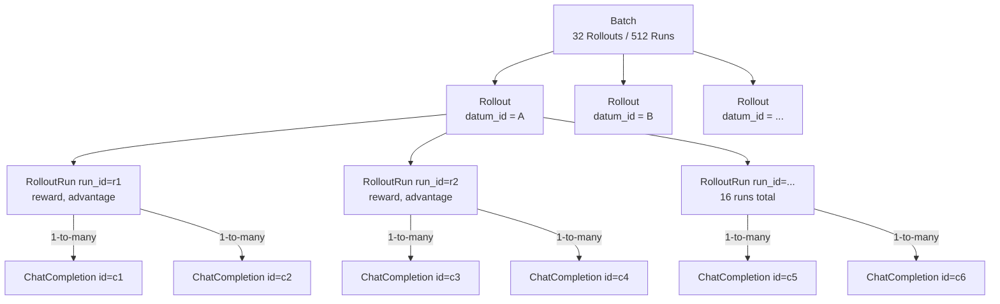

# Data Model: Rollout / Run / ChatCompletion

This reference explains the core data-modeling concepts used by the Ollie RL
api server, and how they map onto familiar GRPO terminology (group, batch,
advantage). Read this before working on `TunerService`, `RunModel`,
`ChatCompletionModel`, or any rollout-collection / training-step code path.

## TL;DR

```
Batch          = N Rollouts consumed by one train_step
Rollout        = a GRPO group: K runs that share the same datum_id
Run            = one attempt at a datum_id; identified by run_id (RunModel)
ChatCompletion = a single LLM request/response inside a run (ChatCompletionModel)
Reward         = scalar score attached to (tuner_id, run_id) by the client
Advantage      = per-run value derived from rewards within the same Rollout
Datum Pool     = registered list of datum_ids for a tuner (DatumRowModel)
```

Note: there is no `RolloutGroup` type. The `Rollout` Pydantic model *is*
the group. The K elements inside it are `RolloutRun`s.



## Core Entities

### Datum Pool (`DatumRowModel`)
A registered list of datum_ids representing the corpus/dataset for a tuner. Treat `datum_id` as opaque. Populated at `POST /tuners` creation time from the request body (`datum_ids`). A tuner is useless without a corpus, so registering it upfront is required.

### Run (`RunModel`)
A single attempt at a `datum_id` under a particular tuner. It is the canonical run record and contains the reward and training bookkeeping:

- `id` (run_id) - server-allocated unique identifier dispensed via `POST /runs`.
- `tuner_id` - the tuner this run belongs to.
- `datum_id` - the dataset item being attempted.
- `reward` - scalar float score written by the client via `PUT /reward`.
- `train_count` - number of times the run has already been included in a training batch. New runs start at 0; after a batch they are bumped to 1.
- `expires_at` - lease deadline for redispense (default 5 minutes). If a run has `reward IS NULL` and `expires_at <= NOW()`, its lease is expired and the dispenser is free to re-dispense that `datum_id` under a fresh `run_id`.

### ChatCompletion (`ChatCompletionModel`)
The lowest-level record: one LLM request/response. Persisted in the `chat_completions` table with:

- `id` - unique completion ID.
- `tuner_id` - the tuner this completion belongs to.
- `run_id` - the run this completion belongs to.
- `datum_id` - the dataset item, derived from the run record on the server (client cannot lie).
- `policy_generation` - stamped from `Sample.policy_generation` at completion-record time to track which model weight version produced the sample.

### Rollout (the group)
`Rollout(runs)` is the in-memory representation of a GRPO group. It is built by `TunerService._collect_consumable_batch` and contains the K runs that share the same `datum_id`, each with its computed `advantage`.

```python
class RolloutRun(BaseModel):
    id: str           # run_id
    reward: float
    advantage: float

class Rollout(BaseModel):
    runs: List[RolloutRun]
```

Constants currently used:
- `GROUP_SIZE = 16` – runs needed before a `Rollout` is "ready".
- `TARGET_MAX_TRAIN_COUNT = 0` – only runs that have not been trained yet are eligible.

### Batch
A batch is what the trainer actually consumes in one `train_step`. Today this is hard-coded in `TunerService._collect_consumable_batch`:

- `TARGET_GROUP_COUNT = 32` – we wait until ≥ 32 ready `Rollout`s exist, then take the first 32 as the batch.
- Each `Rollout` in the batch is flattened to its `RolloutRun`s; each run is mapped back to its `ChatCompletion` rows and emitted as an `Example(chat_completion_id, advantage)` for `Tuner.train_step`.
- After the trainer accepts the batch, we bump `train_count` for every included `run_id` so the same runs are not reused.

## GRPO Concepts in this Codebase

### What is a "group" in GRPO?
GRPO (Group Relative Policy Optimization) does not need an external value function. Instead, for each prompt it samples K candidate trajectories, scores them, and uses their relative reward inside that **group** to estimate an advantage:

```
advantage_i = (reward_i - mean(rewards)) / (std(rewards) + eps)
```

In this codebase:
- A group is materialized as a `Rollout` and is uniquely identified by `datum_id` within a tuner.
- The K runs of the group are independent `run_id`s with rewards attached.
- The advantage computation happens in `_collect_consumable_batch` (with `eps = 1e-8` and a degenerate-std fallback that emits `advantage = 0`).

### What is a "batch"?
A batch is the collection of groups consumed by one optimizer step. GRPO loss is computed over many `(chat_completion, advantage)` pairs at once so that gradients are well averaged. In this codebase:

- A batch is exactly `TARGET_GROUP_COUNT` (32) ready `Rollout`s.
- Inside the trainer (`Tuner.train_step`), the flattened `Example`s of that batch correspond to 32 × 16 = 512 runs. Since a single run can contain multiple chat completions, the total number of chat completion examples passed to the trainer will be at least 512 (and potentially more if runs have multi-turn interactions).
- "Ready" means every run in the group has a non-null reward and `train_count == 0`. Partial groups are silently skipped until they fill up.

## End-to-End Request Lifecycle

```mermaid
sequenceDiagram
    participant Client
    participant API as FastAPI app
    participant TS as TunerService
    participant DB as Database
    participant T as Tuner

    Client->>API: POST /tuners/{tuner_id}/runs
    API->>TS: dispense_run(tuner_id)
    TS->>DB: SELECT datum_ids FROM datum_rows WHERE tuner_id=…
    TS->>T: dispense_run(ctx)
    T-->>TS: RunAssignment(run_id, datum_id)
    TS->>DB: INSERT runs (expires_at = NOW() + 5 min)
    API-->>Client: 200 { run_id, datum_id, expires_at }

    Client->>API: POST /openai/v1/chat/completions<br/>X-Tuner-Id, X-Run-Id
    API->>TS: get(tuner_id)
    TS->>T: sample(request)
    T-->>API: ChatCompletion
    API->>TS: record_chat_completion(id, tuner_id, run_id, datum_id, policy_generation)
    TS->>DB: INSERT chat_completions

    Client->>API: PUT /tuners/{tuner_id}/runs/{run_id}/reward<br/>{ reward }
    API->>TS: update_reward(tuner_id, run_id, reward)
    TS->>DB: UPDATE runs SET reward=…

    Note over TS: Background / triggered call
    TS->>DB: BEGIN; SELECT tuners WHERE id=? FOR UPDATE
    TS->>TS: _collect_consumable_batch(tuner_id, session)
    TS->>DB: SELECT runs WHERE train_count=0 AND reward IS NOT NULL
    TS->>TS: group by datum_id, keep groups of 16<br/>(each becomes a Rollout)<br/>compute advantage per run
    TS->>DB: SELECT chat_completions for run_ids
    TS->>T: train_step(examples)
    TS->>DB: UPDATE runs SET train_count = train_count + 1
    TS->>DB: COMMIT
    T-->>TS: TrainOp.wait()
```

## Quick Pointers to Code

- `src/ollie_rl/types.py` – `Rollout`, `RolloutRun`, request DTOs.
- `src/ollie_rl/db/models.py` – `TunerModel`, `ChatCompletionModel`, `RunModel`, `DatumRowModel`.
- `src/ollie_rl/service/tuner_service.py` – `record_chat_completion`, `update_reward`, `_collect_consumable_batch`, `dispense_run`, `maybe_train`. This is where group size, batch size, and advantage math live.
- `src/ollie_rl/cookbook/types.py` – `Example(chat_completion_id, advantage)`, the contract handed to `Tuner.train_step`.
- `src/ollie_rl/server/app.py` – HTTP surface: run dispensing, chat completion ingestion, reward submission, tuner creation.

## Things That Are Easy to Get Wrong

- **`run_id` vs `datum_id`.** `run_id` is one attempt; `datum_id` is the dataset item. A `Rollout` (group) is many `run_id`s under the same `datum_id`.
- **Lease Expiration vs Training Consumption.** `expires_at` is only used to manage the worker lease. If a worker fails to submit a reward before `expires_at`, the dispenser can re-issue the datum. However, once a run is successfully rewarded, it stays consumable for training (`train_count == 0`) regardless of whether `expires_at` has passed.
- **Group readiness is exact, not minimum.** `_collect_consumable_batch` only yields `Rollout`s whose size equals `GROUP_SIZE` (16); extra runs beyond 16 are dropped on the floor during the in-memory grouping pass.
- **`train_count` is a guard, not a counter of optimizer steps.** It is incremented after the trainer accepts the batch, so reused runs are skipped on the next call.
- **Advantage uses population std with eps.** Degenerate groups (std ≈ 0) fall back to `advantage = 0` instead of dividing.
- **A run can contain multiple ChatCompletions.** When building `Example`s, every completion in the run inherits the run's advantage.
