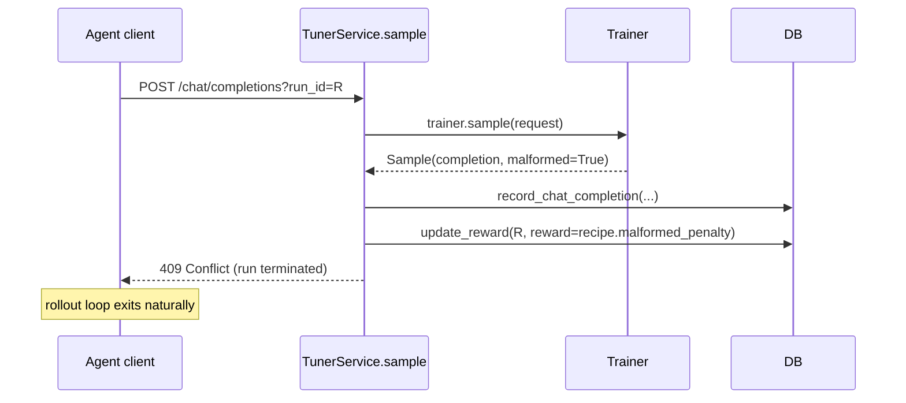

# Design: Handling Malformed Model Output in GRPO Training

This is a **reference design doc** for how the Ollie RL server should
treat samples that the model emits in a syntactically broken form —
most commonly a malformed function/tool call. It supersedes the
current `raise NotImplementedError("Malformed assistant response or
function call")` sites in
`src/ollie_rl/trainer/tinker.py` and `src/ollie_rl/trainer/gemini_msrl.py`.

Read this alongside [`data-model.md`](./data-model.md) (for the
`Run` / `ChatCompletion` / `Reward` lifecycle) and
[`sync-rl.md`](./sync-rl.md) (for the client-visible HTTP contract).

---

## ⚠️ Implementation status (how the shipped design diverged)

This remains the design rationale, but the code that shipped chose a
different surface than the draft below. Treat the specifics here as
historical; the current behavior is:

- **`finish_reason = "content_filter"` *was* adopted** to mark malformed
  samples — the "semantic overload of `content_filter`" alternative that the
  table at the bottom lists as *rejected*. The trainer
  (`trainer/tinker/trainer.py`, `trainer/gemini_msrl.py`) sets
  `finish_reason = "content_filter"` on malformed completions.
- **The penalty is `Recipe.content_filter_penalty` (default `-1.0`)**, not
  `Recipe.malformed_penalty`.
- **The error is `content_filter_sample` → `409 Conflict`** (see
  `server/app.py`), not `MalformedSampleError`. The rest of the flow matches
  the draft: the malformed completion is recorded, the reward is set
  server-side, and the sample trains as a first-class GRPO example (it is
  *not* dropped or re-dispensed).
- **Quarantine interaction:** a `content_filter` run counts in `rewarded` and,
  alongside `length`, feeds the `max_unhealthy_finish_ratio` quarantine
  numerator (`(length + content_filter) / rewarded`). See `quarantined_datums`
  in `service/tuner/dispensing.py`.

---

## TL;DR

- Malformed model output is **expected** during GRPO training,
  especially early on. Raising `NotImplementedError` from
  `Trainer.sample` is hostile to training: one bad rollout aborts the
  enclosing group, no `train_step` ever fires, and the strongest
  available negative-gradient signal is thrown away.
- The cure: when the trainer detects malformed output, the **server
  terminates the run with a configured negative reward** and returns
  **`409 Conflict`** to the agent client. The client's rollout loop
  exits naturally (same handling it already has for "reward already
  set" races). No new client logic. No `finish_reason` overloading.
- The bad token sequence is still recorded as a `ChatCompletionModel`
  row and lands in `Trainer.train_step` as a normal `Example` with a
  large-negative GRPO advantage. The model learns "don't do that"
  from the very rollout that caused the problem.
- The penalty value lives on `Recipe` (`malformed_penalty: float`),
  **not** on the trainer config. Different tasks want different
  magnitudes; trainers are mechanism, recipes are policy.

---

## Why this matters

GRPO is defined by sampling `group_size` completions per prompt,
scoring all of them, and computing per-sample advantages relative to
the group mean. Three properties of that loop collide with raising
on malformed output:

1. **Malformed output is the most useful negative training signal we
   have.** Early in training the policy is *expected* to emit broken
   tool calls. Treating it as a server-side exception means we
   discard the strongest gradient signal available exactly when we
   need it most.
2. **A single bad sample destroys an entire group.** Because
   `sample()` is awaited inside the client's rollout loop and the
   error propagates back as HTTP 500, one malformed completion in a
   group of 16 typically aborts the whole group. The other 15
   rollouts produce no `PUT /reward`, `_collect_consumable_batch` can
   never form a complete group, and `train_step` never fires. The
   training loop stalls in proportion to how badly the model is
   misbehaving — exactly backwards.
3. **`NotImplementedError` is a misleading marker.** The code path
   is reachable in normal operation against any real model. The
   error is load-bearing API contract semantics ("this case is
   intentionally unhandled by design"), being used as a "didn't
   want to think about this" placeholder.

---

## The design

### Wire-level flow



### Why 409 falls out for free

The existing `TunerService` invariants already encode "this run is
terminal":

| Existing behavior | How it composes |
|---|---|
| `update_reward` raises `RewardAlreadySetError` (→ 409) if reward is already set. | The malformed path uses the same mechanism: set the reward, future calls 409. |
| `sample()` raises `RewardAlreadySetError` if the run's reward is non-NULL. | Any retry the agent might attempt on that `run_id` after seeing 409 also returns 409. Agent literally cannot continue on a terminated run. |
| Agent clients already handle 409 from `PUT /reward` races. | No new client logic; the 409 from `/chat/completions` is just one more place the same status can appear. |

### What lands in training

The malformed sample becomes a first-class member of its group:

1. `record_chat_completion(...)` writes the `ChatCompletionModel` row
   for the bad rollout. (Bad tokens included — they are what we
   want to train against.)
2. `update_reward(run_id, recipe.malformed_penalty)` writes the
   reward synchronously, server-side.
3. The remaining `group_size - 1` rollouts for that datum continue
   independently. When they all finish, `_collect_consumable_batch`
   sees a complete group.
4. GRPO advantage is computed: the malformed run has the most
   negative advantage in the group (typically `-1` to a few sigma
   below mean, after normalization).
5. `Trainer.train_step` runs `forward_backward` on the malformed
   token sequence with that negative weight. The model is taught
   to push down probability mass on exactly the trajectory that
   produced the syntactic failure.

### Multi-turn agents

For a multi-turn rollout (turns 1..N where turn N is malformed):

- Turns 1..N-1 are already in `ChatCompletionModel` under the same
  `run_id`.
- The negative reward applies to the **whole trajectory**. GRPO
  operates per-run, not per-turn — every completion in the run
  shares the same advantage.
- This is correct: the agent's earlier turns *led to* the
  malformed final turn. Downweighting the whole trajectory matches
  the credit-assignment story.

---

## Required code changes

### 1. `Sample.malformed`

```python
# src/ollie_rl/trainer/types.py
class Sample(BaseModel):
    completion: ChatCompletion
    policy_generation: str
    malformed: bool = False   # NEW
```

Strictly additive. Existing trainers default to `False`.

### 2. Trainer-side: replace the `NotImplementedError` sites

**`src/ollie_rl/trainer/tinker.py`** (the parse-failure branch in
`_run_sample`):

```python
parsed_message, parse_success = self.renderer.parse_response(sequence.tokens)
malformed = (not parse_success) and sequence.stop_reason != "length"
# ... build completion as usual; on `malformed`, text_content may be raw or empty ...
return Sample(
    completion=completion,
    policy_generation=str(self.state.sampler_step),
    malformed=malformed,
)
```

**`src/ollie_rl/trainer/gemini_msrl.py`** (the
`MALFORMED_FUNCTION_CALL` branch in `GeminiMsrlSamplingOp.wait`):
similarly stop raising; build the completion with whatever text was
returned (or empty), set `malformed=True`.

### 3. `Recipe.malformed_penalty`

```python
class Recipe(BaseModel, frozen=True):
    group_size: int = 16
    num_groups_per_batch: int = 32
    allow_dispense_during_training: bool
    malformed_penalty: float = 0.0    # NEW; see "Penalty magnitude" below
```

### 4. `TunerService.sample`

After `sample = await sample_op.wait()`:

```python
if run_id is not None:
    assert datum_id is not None
    await self.record_chat_completion(
        completion_id=sample.completion.id,
        tuner_id=tuner_id,
        run_id=run_id,
        datum_id=datum_id,
        policy_generation=policy_generation,
    )
    if sample.malformed:
        recipe = await self._recipe_for(tuner_id)
        await self.update_reward(
            tuner_id, run_id, reward=recipe.malformed_penalty
        )
        raise MalformedSampleError(
            f"Malformed sample on run {run_id}; reward set to "
            f"{recipe.malformed_penalty}"
        )

return sample.completion
```

### 5. FastAPI mapping

Map `MalformedSampleError` → `409 Conflict` in `server/app.py`. Body
should distinguish from "reward already set" so the client can log
the distinction even though both produce the same terminal behavior
(rollout exit).

### 6. Metric (recommended)

Increment a `malformed_samples_total{tuner_id=…}` counter on each
hit. Useful operationally:

- Expected: high early, decays over training.
- Stuck-high late in training → recipe bug (e.g. `malformed_penalty`
  too small to overcome noise) or base model mismatch.

---

## Cautions

### Penalty magnitude vs. group `std`

GRPO normalizes via `advantage = (reward - mean) / std`. A very-far
penalty inflates `std` and shrinks the advantages of well-formed
runs in the same group, weakening their gradient signal.

**Recommendation:** pick `malformed_penalty` close to the low end of
the well-formed reward distribution. If well-formed rewards live in
`[0, 1]`, `malformed_penalty = 0.0` is sane; `-1e6` is not.

### Whole-group-malformed degenerate case

If *every* rollout in a group is malformed (early training, weak
base model):

- All rewards equal `malformed_penalty`.
- `std ≈ 0`.
- Per the `_collect_consumable_batch` formula, advantage = `0.0`
  for every run.
- Group contributes no gradient.

This is **correct** — you cannot learn from a group with no
relative signal — but it's worth logging. A `degenerate_groups_total`
counter, or just the existing "not enough groups ready" log line,
should make this visible.

### Token storage for tinker

`TinkerTrainer.train_step` needs the actual token sequence to do
`forward_backward`. The Phase 3 `ChatCompletionModel` column
addition (`tokens` BLOB) already planned in
[`tinker-trainer.md`](./tinker-trainer.md) covers this; the malformed
path uses the same column. No additional schema change.

For `gemini_msrl`, the candidate is held server-side under
`candidate_id` (= `ChatCompletionModel.id`); the existing
`TrainStepRequest` plumbing works unchanged.

---

## Alternatives considered (and rejected)

| Alternative | Why rejected |
|---|---|
| Surface as a normal completion with `finish_reason="stop"`. | Requires the reward function (client-side) to detect malformed output and assign a penalty. Pushes server problem onto every recipe. |
| Use `finish_reason="content_filter"` to signal malformed. | Same client-side burden, plus semantic overload of `content_filter`. |
| Retry-with-different-seed inside `sample()`. | Masks the very behavior GRPO is meant to train away. Wastes inference budget. Pathological early in training. |
| Drop the sample and re-dispense the run. | Loses the training signal entirely. Useful for SFT data-quality flows; wrong for RL. |
| Per-trainer penalty config instead of `Recipe`. | Different tasks want different magnitudes; centralizing on `Recipe` keeps trainers as pure mechanism. Same reasoning as why `max_steps_off_policy` lives on `TinkerTrainerConfig` but `num_groups_per_batch` lives on `Recipe`. |

---

## Open questions

- **Should `MalformedSampleError` carry the malformed text content
  back to the client (in the 409 body)?** Pro: lets the agent
  process log the actual bad output for debugging. Con: agents that
  log indiscriminately may leak tool-call fragments. Default: yes,
  include the raw text; clients that don't want it can ignore it.
- **Do we want a per-run `malformed: bool` column on `RunModel`?**
  Today the malformed-ness is implicit in `reward ==
  malformed_penalty`, which is brittle (a real reward could equal
  the penalty by coincidence). Adding a column is cheap and makes
  later metric/dashboard queries trivial. Recommend yes in the
  same PR that adds `Recipe.malformed_penalty`.
- **Interaction with the multi-turn `X-Run-Id`-on-result-only
  pattern from `sync-rl.md`.** If the agent's "scratchpad" turn
  (no `X-Run-Id`) emits malformed output, there is no run to
  terminate. That call should fall back to returning the completion
  as-is with `finish_reason="stop"` and an empty/raw body — the
  rollout's later result-affecting turn still gets a chance to
  produce a clean sample. Document this asymmetry in `sync-rl.md`
  when the change lands.
