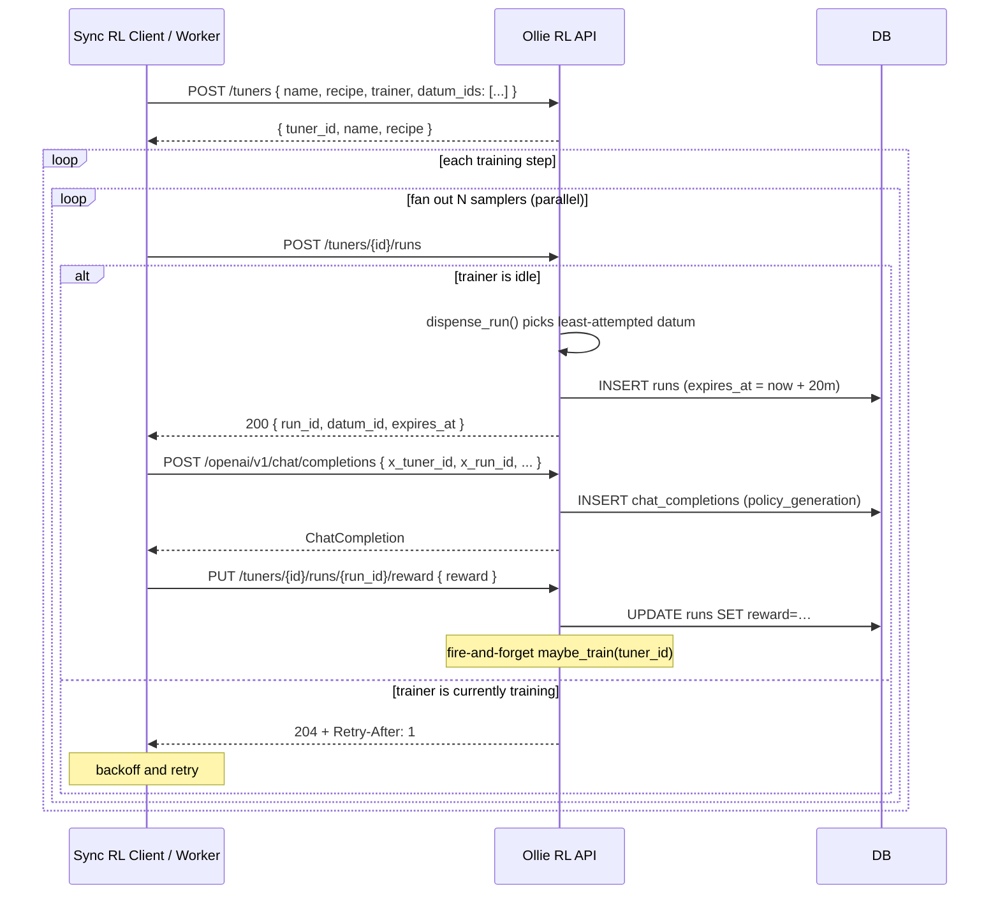
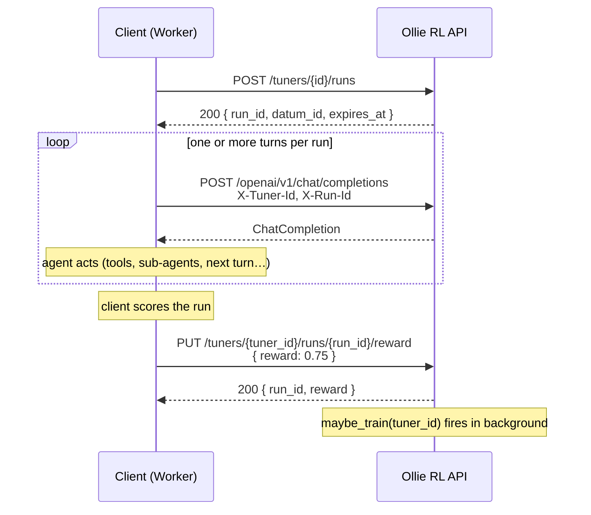

# How to Interact with the Ollie RL API Server (Sync RL)

This reference describes how a **synchronous RL** client drives the Ollie
RL api server over its public HTTP API. By "sync RL" we mean the
canonical GRPO loop where sampling pauses while training is in flight,
and the server dispenses run assignments to coordinate multiple parallel workers.

A **run** is the unit of reward / advantage. A single run may internally
contain multiple trajectories (e.g. multi-step or agent-with-sub-agent setups);
they all share the same `run_id`, reward, and advantage.

## API Surface the Client Talks To

| Endpoint                                       | Purpose                                   |
|------------------------------------------------|-------------------------------------------|
| `POST /tuners`                                 | Create a tuner with a registered datum pool. |
| `GET /tuners/{tuner_id}`                       | Retrieve tuner details and trainer state. |
| `POST /tuners/{tuner_id}/runs`                 | Request a new run assignment.             |
| `POST /openai/v1/chat/completions`             | Sample one LLM response inside a `run_id`.|
| `PUT /tuners/{tuner_id}/runs/{run_id}/reward`  | Submit the scalar reward for a `run_id`.  |

Training is applied implicitly by the server as rewards arrive (the
`PUT /reward` handler schedules `TunerService.maybe_train(tuner_id)` in
the background); the client does not need to trigger it explicitly.

> Note: `GET /tuners/{tuner_id}` provides observability for tuner details,
> including current policy generation and stored trainer state (`trainer_state`).
> Any unrouted path returns a `307` redirect to `/docs` (the Swagger UI),
> which is also the easiest way to introspect the live HTTP surface.

### `POST /tuners` body

| Field        | Required | Default        | Meaning                                   |
|--------------|----------|----------------|-------------------------------------------|
| `name`       | yes      | —              | Display name for the tuned model.         |
| `datum_ids`  | yes      | —              | Non-empty list of opaque dataset item ids.|
| `recipe`     | yes      | —              | Named recipe in the `Cookbook` registry (e.g. `grpo_16x32`). |
| `trainer`    | yes      | —              | Named factory in the trainer registry (e.g. `gemini_msrl`, `fake`). |

### Required headers on `/openai/v1/chat/completions`

| Header        | Required | Meaning                                                     |
|---------------|----------|-------------------------------------------------------------|
| `X-Tuner-Id`  | yes      | Which tuner / policy to sample from.                        |
| `X-Run-Id`    | yes\*    | The run this completion belongs to.                         |

\* `X-Run-Id` should be sent for **any request whose output affects the final result** the agent is being scored on (i.e. completions that participate in solving the task and will be used as training examples). Auxiliary requests that do not affect the result — for example generating a chat title, summarizing logs, or other side-channel calls that are not part of the task context — should **omit** the header so they are not recorded as training examples. Note that the server automatically maps the `run_id` to its assigned `datum_id` to prevent client-side tampering; clients never send `datum_id` in a header.

## One Training Step, Visualized

A single sync-RL step has three phases visible to the client.

### Phase 0 — bootstrap (once per training job)

`POST /tuners` with `name`, `recipe`, `trainer`, and `datum_ids` (non-empty) to create a tuner.
The server returns `{ tuner_id, name, recipe }`. Persist `tuner_id` somewhere durable — it is the only handle to the policy on the server.

### Phase 1 — request run assignments

Workers request work by calling `POST /tuners/{tuner_id}/runs` with an empty body:

- **200 OK**: Returns `{ run_id, datum_id, expires_at }`. The worker should execute the run.
- **204 No Content**: The trainer is currently in the middle of a train step. The response includes a `Retry-After: 1` header. The worker should back off and retry.

Optional query param `max_expire_rate` (float in `[0, 1]`, omit to disable): when set, the dispenser skips ("quarantines") datums that genuinely keep expiring — those whose recent expiration rate is `>= max_expire_rate`. The rate counts only `expired` runs: unrewarded runs whose lease passed while a lingering in-flight op remained (an `InFlightChatCompletionModel` row — the generation itself stalled past the lease). `lost` runs (crashed/abandoned worker, or runs abandoned after their ops completed) are *not* counted. The rate is measured over a recent policy-generation window so quarantined datums can recover automatically. See the "Expiration quarantine" section in `tuner_service.py` for the full mechanism.

### Phase 2 — execute run and submit reward

For every dispensed `(datum_id, run_id)`, the client drives an agent run that may issue **multiple** chat completion calls (multi-turn dialogue, tool use, sub-agent calls, etc.), all sharing the same `run_id`. Once the run terminates, the client submits one scalar reward for it via `PUT /tuners/{tuner_id}/runs/{run_id}/reward`.

### Phase 3 — loop

The client simply continues the loop, requesting the next run assignment. The server manages group sizes, batching, and training barriers internally.

## Things a Sync-RL Client Must Get Right

- **Never reuse a `run_id`.** The server allocates the `run_id` dynamically; always use the `run_id` dispensed by the server.
- **Send `X-Run-Id` on result-affecting completions.** Without it, the completion is not recorded and the run cannot contribute to training. Conversely, omit it on auxiliary calls so they are not picked up as training examples.
- **Submit rewards before the run expires.** Every run is leased with an expiration deadline (`expires_at`, default **20 minutes / 1200 s**, and each recorded chat completion pushes the deadline out by that much again — see `RUN_EXPIRE_SECONDS` / `dispense_run` in `tuner_service.py`). If a reward is posted after the lease expires, the server returns `409 Conflict` because the dispenser may have already re-issued that datum to another worker.
- **Rewards are write-once.** Once a reward has been submitted for a `run_id`, it cannot be changed. Subsequent `PUT /reward` calls on the same `run_id` return `409 Conflict`.
- **Chat completions inside a run also respect the lease.** `POST /openai/v1/chat/completions` will return `409` if the run has already been rewarded or its lease has expired, and `400` if the `X-Run-Id` is unknown.
- **Pace yourself.** The server does not limit concurrent completions or rewards. A sync-RL driver should bound its own fan-out so the server is not overwhelmed by a flood of HTTP work.
- **Expect `204 + Retry-After` during training barriers.** Implicit training is triggered fire-and-forget when a reward is posted. While a `train_step` is in flight on a tuner, `POST /tuners/{tuner_id}/runs` returns `204 No Content` with `Retry-After: 1`. Clients should treat this as a polite "come back in a second", not an error.
