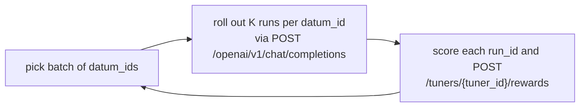
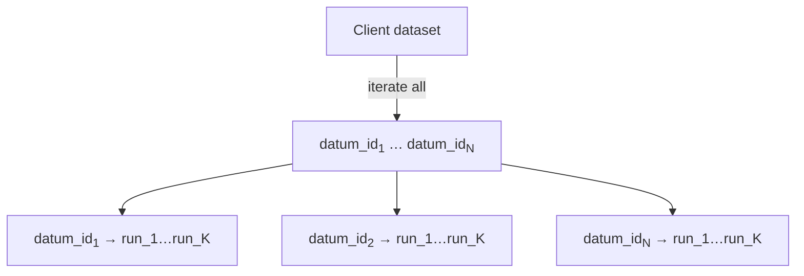
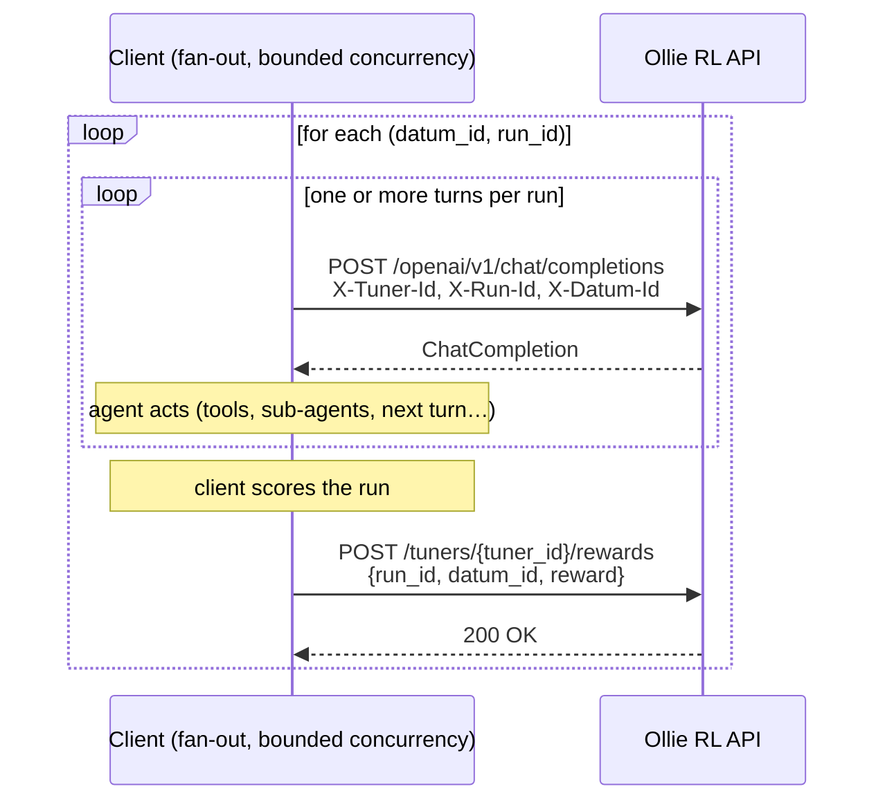

# How to Interact with the Ollie RL API Server (Sync RL)

This reference describes how a **synchronous RL** client drives the Ollie
RL api server over its public HTTP API. By "sync RL" we mean the
canonical GRPO loop where the client owns the outer training loop and
waits for each phase to finish before moving on:

A **run** is the unit of reward / advantage. A single run may internally
contain multiple trajectories in the future (e.g. multi-agent or
agent-with-sub-agent setups); they all share the same `run_id`, reward,
and advantage.

## API Surface the Client Talks To

| Endpoint                                  | Purpose                                   |
|-------------------------------------------|-------------------------------------------|
| `POST /tuners`                            | Create / restore a tuner from a recipe.   |
| `POST /openai/v1/chat/completions`        | Sample one LLM response inside a `run_id`.|
| `POST /tuners/{tuner_id}/rewards`         | Submit the scalar reward for a `run_id`.  |

Training happens implicitly on the server side as rewards are submitted;
the client does not need to (and cannot) trigger it explicitly today.

### Required headers on `/openai/v1/chat/completions`

| Header        | Required | Meaning                                                     |
|---------------|----------|-------------------------------------------------------------|
| `X-Tuner-Id`  | yes      | Which tuner / policy to sample from.                        |
| `X-Run-Id`    | yes\*    | The run this completion belongs to.                         |
| `X-Datum-Id`  | yes\*    | The dataset item being attempted.                           |

\* `X-Run-Id` and `X-Datum-Id` should be sent for **any request whose
output affects the final result** the agent is being scored on (i.e.
completions that participate in solving the task and will be used as
training examples). Auxiliary requests that do not affect the result —
for example generating a chat title, summarizing logs, or other
side-channel calls that are not part of the task context — should
**omit** both headers so they are not recorded as training examples.

## One Training Step, Visualized

A single sync-RL step has three phases visible to the client.

### Phase 0 — bootstrap (once per training job)

`POST /tuners` with the recipe payload to create (or restore) a tuner.
The server returns a `tuner_id`. Persist it somewhere durable — it is
the only handle to the policy on the server, and the same id later
recovers the tuner.

### Phase 1 — plan the epoch

The usual practice is to iterate over **all** `datum_id`s in the dataset
and mint a fresh set of `K` `run_id`s per `datum_id`. One full pass over
the dataset is essentially one epoch; the client controls throughput by
limiting concurrency, not by batching.

Each `run_id` must be globally unique under the tuner.

### Phase 2 — fan out rollouts and rewards

For every `(datum_id, run_id)` the client drives an agent run that may
issue **multiple** chat completion calls (multi-turn dialogue, tool
use, sub-agent calls, etc.), all sharing the same `run_id`. Once the
run terminates, the client submits one scalar reward for it.

The server does not back-pressure on rollouts, so pacing is the client's
job — typically a bounded semaphore / worker pool that limits how many
concurrent runs (or completions) are in flight.

### Phase 3 — loop

Once the iteration over the dataset finishes, that epoch is done. Start
the next epoch by iterating over the dataset again with fresh
`run_id`s. Training is applied implicitly by the server as rewards are
submitted; the client just keeps feeding new `(datum_id, run_id)` pairs.

## Things a Sync-RL Client Must Get Right

- **One `run_id` = one run (one attempt at a `datum_id`).** Never reuse
  a `run_id` across runs, even after training — the server uses it as
  the unit of reward and advantage. A run may itself span multiple
  trajectories internally (e.g. multi-agent or agent-with-sub-agent),
  but they all share the same `run_id`, reward, and advantage.
- **Send `X-Run-Id` and `X-Datum-Id` on result-affecting completions.**
  Without them the completion is not recorded and the run cannot
  contribute to training. Conversely, omit them on auxiliary calls
  (title generation, log summarization, etc.) so they are not picked up
  as training examples.
- **`datum_id` is sticky for a `run_id`.** Once a reward has been
  submitted for a `run_id` with a given `datum_id`, you cannot change
  the `datum_id` on the same run. If your dataset id scheme changes,
  mint new `run_id`s.
- **Submit rewards before moving on.** A run without a reward will not
  contribute meaningful training signal.
- **Do not re-submit rewards for a `run_id` that has already been used
  for training.** Overwriting a reward after the fact has no effect on
  already-applied gradients and only adds noise.
- **Pace yourself.** The server does not limit concurrent completions
  or rewards. A sync-RL driver should bound its own fan-out so the
  server is not overwhelmed by a flood of HTTP work.
