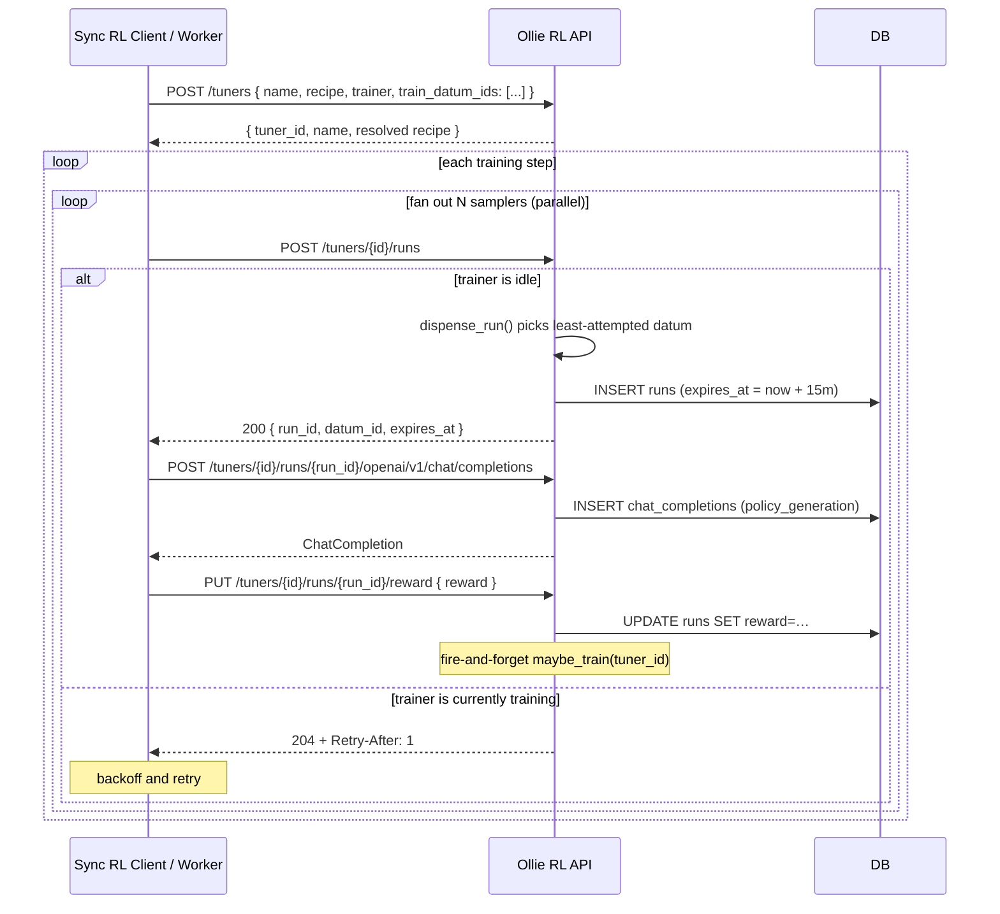
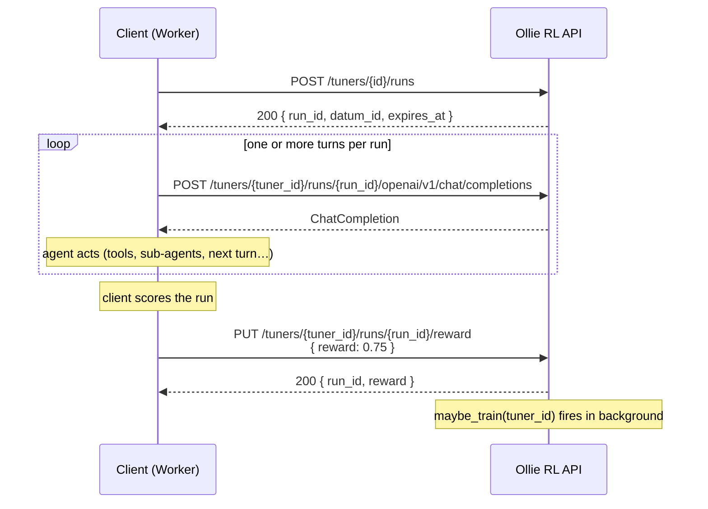

# How to Interact with the Ollie RL API Server (Sync RL)

This reference describes how a **synchronous RL** client drives the Ollie
RL api server over its public HTTP API. By "sync RL" we mean the
canonical GRPO loop where sampling pauses while training is in flight,
and the server dispenses run assignments to coordinate multiple parallel workers.

```mermaid
sequenceDiagram
    participant C as Sync RL Client / Worker
    participant API as Ollie RL API
    participant DB as DB

    C->>API: POST /tuners { name, recipe, trainer, train_datum_ids: [...] }
    API-->>C: { tuner_id, name, resolved recipe }

    loop each training step
        loop fan out N samplers (parallel)
            C->>API: POST /tuners/{id}/runs
            alt trainer is idle
                API->>API: dispense_run() picks least-attempted datum
                API->>DB: INSERT runs (expires_at = now + 15m)
                API-->>C: 200 { run_id, datum_id, expires_at }
                C->>API: POST /tuners/{id}/runs/{run_id}/openai/v1/chat/completions
                API->>DB: INSERT chat_completions (policy_generation)
                API-->>C: ChatCompletion
                C->>API: PUT /tuners/{id}/runs/{run_id}/reward { reward }
                API->>DB: UPDATE runs SET reward=…
                Note over API: fire-and-forget maybe_train(tuner_id)
            else trainer is currently training
                API-->>C: 204 + Retry-After: 1
                Note over C: backoff and retry
            end
        end
    end
```

A **run** is the unit of reward / advantage. A single run may internally
contain multiple trajectories (e.g. multi-step or agent-with-sub-agent setups);
they all share the same `run_id`, reward, and advantage.

## API Surface the Client Talks To

| Endpoint                                       | Purpose                                   |
|------------------------------------------------|-------------------------------------------|
| `POST /tuners`                                 | Create a tuner with a registered datum pool. |
| `GET /tuners/{tuner_id}`                       | Retrieve tuner details and trainer state. |
| `POST /tuners/{tuner_id}/runs`                 | Request a new run assignment.             |
| `POST /tuners/{tuner_id}/runs/{run_id}/openai/v1/chat/completions` | Sample one LLM response inside a run. |
| `PUT /tuners/{tuner_id}/runs/{run_id}/reward`  | Submit the scalar reward for a `run_id`.  |

Training is applied implicitly by the server as rewards arrive (the
`PUT /reward` handler schedules `TunerService.maybe_train(tuner_id)` in
the background); the client does not need to trigger it explicitly.

> Note: `GET /tuners/{tuner_id}` provides observability for tuner details,
> including current policy generation and stored trainer state (`trainer_state`).
> Any unrouted path returns a `307` redirect to `/docs` (the Swagger UI),
> which is also the easiest way to introspect the live HTTP surface.

### `POST /tuners` body

| Field             | Required | Default | Meaning |
|-------------------|----------|---------|---------|
| `name`            | yes      | —       | Display name for the tuned model. |
| `train_datum_ids` | yes      | —       | Non-empty list of opaque training item ids. |
| `eval_datum_ids`  | no       | `[]`    | Held-out item ids scored per checkpoint. |
| `recipe`          | yes      | —       | A preset string, or an object containing fields layered over the `Recipe` defaults. |
| `trainer`         | yes      | —       | Named factory in the trainer registry (e.g. `gemini_msrl`, `fake`). |

Recipe objects resolve built-in defaults followed by their explicit fields. The
server validates and persists the complete immutable snapshot. Both create and
detail responses return that snapshot as `recipe`.

### Run-addressed chat completions

The OpenAI-compatible base URL for an assigned run is
`/tuners/{tuner_id}/runs/{run_id}/openai/v1`. Configure the agent with this
base URL so its chat-completion requests are automatically attributed to the
run. Every completion sent through this endpoint is recorded as training data;
auxiliary model calls that should not affect training must use another model
provider. The server maps the run to its assigned `datum_id`, so clients never
supply the datum id themselves.

## One Training Step, Visualized

A single sync-RL step has three phases visible to the client.

### Phase 0 — bootstrap (once per training job)

`POST /tuners` with `name`, `recipe`, `trainer`, and non-empty
`train_datum_ids` to create a tuner. The server returns the tuner identity and
resolved recipe snapshot. Persist `tuner_id` somewhere durable — it is the only
handle to the policy on the server.

### Phase 1 — request run assignments

Workers request work by calling `POST /tuners/{tuner_id}/runs` with an empty body:

- **200 OK**: Returns `{ run_id, datum_id, expires_at }`. The worker should execute the run.
- **204 No Content**: The trainer is currently in the middle of a train step. The response includes a `Retry-After: 1` header. The worker should back off and retry.

**Datum quarantine** is configured on the tuner's `Recipe` (not via query params): the dispenser skips ("quarantines") datums that no longer yield a useful learning signal. Both filters are measured over the datum's **rewarded** attempts (all-time — no recency window) and only take effect once the datum has accumulated at least `quarantine_min_samples` rewarded attempts:

- `max_unhealthy_finish_ratio` — quarantine when the fraction of rewarded attempts that ended on an **unhealthy finish reason** is `>= this value`. Unhealthy finishes are the two auto-penalty finish reasons summed together: `length` (length-limited, incl. the context-window guard rewriting an oversized completion) and `content_filter` (a malformed model output the server terminated with `content_filter_penalty`). The rate is `(length + content_filter) / rewarded`.
- `max_succeed_ratio` — quarantine when the success ratio (`reward == 1.0` over rewarded attempts, `succeeded / rewarded`) is `>= this value` (solved too reliably).

Both filters share the full `rewarded` denominator and the `quarantine_min_samples` gate. The default ratios (`1.0` / `1.0`) fire only at the extreme. Since a quarantined datum receives no new runs, once it crosses a threshold it stays quarantined. `expired` / `lost` runs are observability-only and are **not** a quarantine metric. See `quarantined_datums` in `service/tuner/dispensing.py` for the full mechanism.

### Phase 2 — execute run and submit reward

For every dispensed `(datum_id, run_id)`, the client drives an agent run that may issue **multiple** chat completion calls (multi-turn dialogue, tool use, sub-agent calls, etc.), all sharing the same `run_id`. Once the run terminates, the client submits one scalar reward for it via `PUT /tuners/{tuner_id}/runs/{run_id}/reward`.

```mermaid
sequenceDiagram
    participant C as Client (Worker)
    participant API as Ollie RL API

    C->>API: POST /tuners/{id}/runs
    API-->>C: 200 { run_id, datum_id, expires_at }
    loop one or more turns per run
        C->>API: POST /tuners/{tuner_id}/runs/{run_id}/openai/v1/chat/completions
        API-->>C: ChatCompletion
        Note over C: agent acts (tools, sub-agents, next turn…)
    end
    Note over C: client scores the run
    C->>API: PUT /tuners/{tuner_id}/runs/{run_id}/reward<br/>{ reward: 0.75 }
    API-->>C: 200 { run_id, reward }
    Note over API: maybe_train(tuner_id) fires in background
```

### Phase 3 — loop

The client simply continues the loop, requesting the next run assignment. The server manages group sizes, batching, and training barriers internally.

## Things a Sync-RL Client Must Get Right

- **Never reuse a `run_id`.** The server allocates the `run_id` dynamically; always use the `run_id` dispensed by the server.
- **Use the run-addressed OpenAI base URL.** Every completion under `/tuners/{tuner_id}/runs/{run_id}/openai/v1` is recorded for that run. Route auxiliary, non-training calls through another provider.
- **Submit rewards before the run expires.** Every run starts with a **15-minute / 900-second** lease. Each successfully recorded chat completion resets `expires_at` to 15 minutes from that completion time; it does not add 15 minutes to the previous deadline. This keeps an active multi-turn run alive while allowing an abandoned run's datum to be re-issued under a fresh run id. Completions and rewards submitted after expiration are rejected with `403 Forbidden` (see `RUN_LEASE_SECONDS`).
- **Rewards are write-once.** Once a reward has been submitted for a `run_id`, it cannot be changed. Subsequent `PUT /reward` calls on the same `run_id` return `409 Conflict`.
- **Chat completions inside a run also respect the lease.** The run-addressed chat-completion endpoint rejects requests when the run has already been rewarded, its lease has expired, or its path contains an unknown run id.
- **Pace yourself.** The server does not limit concurrent completions or rewards. A sync-RL driver should bound its own fan-out so the server is not overwhelmed by a flood of HTTP work.
- **Expect `204 + Retry-After` during training barriers.** Implicit training is triggered fire-and-forget when a reward is posted. While a `train_step` is in flight on a tuner, `POST /tuners/{tuner_id}/runs` returns `204 No Content` with `Retry-After: 1`. Clients should treat this as a polite "come back in a second", not an error.
