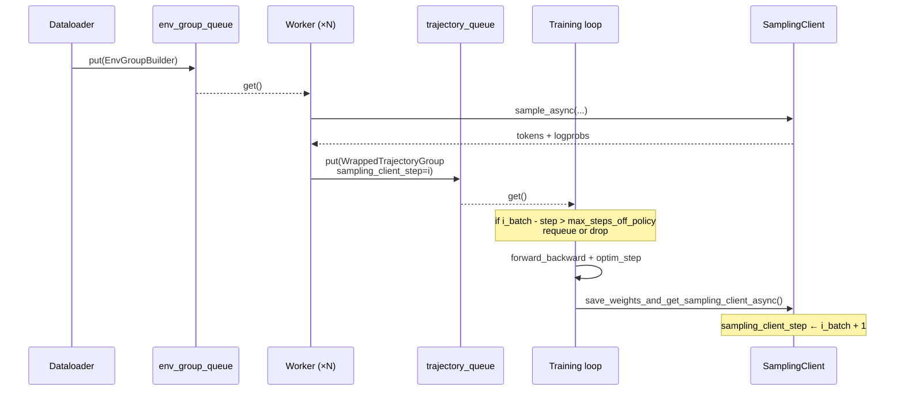
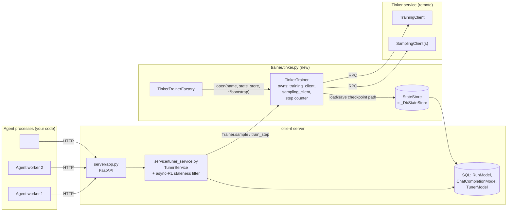
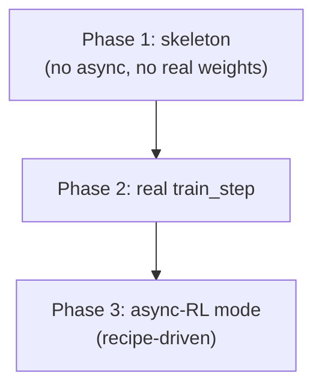

# Plan: Tinker Trainer for Async RL Agent Training

This is a **planning document** (not a spec) for integrating
[Tinker](https://tinker-docs.thinkingmachines.ai/) as a real `Trainer`
backend behind ollie-rl's existing `Trainer` / `TrainerFactory`
protocol, with first-class support for **async RL** (sampling and
training running concurrently against a streaming pool of rewarded
runs).

It is informed by the reference implementation in
[`tinker-cookbook/tinker_cookbook/recipes/harbor_rl`](https://github.com/thinking-machines-lab/tinker-cookbook/tree/main/tinker_cookbook/recipes/harbor_rl)
and especially the async training loop in
[`tinker_cookbook/rl/train.py`](https://github.com/thinking-machines-lab/tinker-cookbook/blob/main/tinker_cookbook/rl/train.py).

Read this **alongside**
[`data-model.md`](./data-model.md) and
[`sync-rl.md`](./sync-rl.md) — those describe the wire/data contract
this plan must preserve.

---

## TL;DR

- Implement `TinkerTrainer` + `TinkerTrainerFactory` in
  `src/ollie_rl/trainer/tinker.py`, registered under the name `"tinker"`
  (the same string the README already advertises in
  `POST /tuners { "trainer": "tinker" }`).
- Reuse the existing `Trainer` protocol **unchanged**. No new methods,
  no per-trainer capability flags.
- Add **async-RL semantics** to `TunerService` via a single recipe-level
  switch (`max_steps_off_policy`) that drives **both** the off-policy
  filter in `_collect_consumable_batch` and the gate in
  `dispense_run`. The latter reads a derived
  `Recipe.allow_sample_during_train` `@property` so call sites stay
  declarative. ollie-rl's HTTP surface already provides the
  parallelism that the four-coroutine loop in
  `tinker-cookbook/rl/train.py` builds in-process.
- Extend `Recipe` with one optional knob (`max_steps_off_policy`) and
  a derived `allow_sample_during_train` property to express the
  async-RL contract declaratively. The other half of tinker's
  `AsyncConfig` (`groups_per_batch`) is already covered by the
  existing `num_groups_per_batch`. Sync vs. async is a recipe choice —
  the same `TinkerTrainer` / `GeminiMsrlTrainer` runs in either mode
  unchanged, because both backends already serialize sample/train
  internally.
- Persist tinker checkpoint state through the existing `StateStore`
  (already SQL-backed via `_DbStateStore` in `TunerService`).

The HTTP surface and DB schema do **not** change. The training loop in
`TunerService.maybe_train` gets one new filter; the rest is contained
inside the new trainer module.

---

## Why this is needed

The README's roadmap promises a `tinker` trainer backend and the
"sidecar" pitch leans heavily on it. Today the registry only ships:

| Name              | Module                                  | Purpose             |
|-------------------|-----------------------------------------|---------------------|
| `fake`            | `src/ollie_rl/trainer/fake.py`          | Tests / local dev   |
| `gemini_msrl`     | `src/ollie_rl/trainer/gemini_msrl.py`   | Google MSRL backend |

Without a real local trainer, the sidecar story is unverifiable on
commodity GPUs and CI cannot exercise the end-to-end loop against a
backend that actually updates weights. Tinker is the obvious first
target because:

- Its `TrainingClient` / `SamplingClient` split maps cleanly onto
  ollie-rl's `Trainer.train_step` / `Trainer.sample`.
- `tinker_cookbook` already publishes a fully worked **async RL** loop
  (`do_async_training`), so we have a reference for *every* edge case
  (staleness, requeueing, off-policy thresholds, sampler-snapshot
  cadence).

---

## Reference: how tinker-cookbook does async RL

Trimmed read of
[`harbor_rl/train.py`](https://github.com/thinking-machines-lab/tinker-cookbook/blob/main/tinker_cookbook/recipes/harbor_rl/train.py)
and
[`rl/train.py`](https://github.com/thinking-machines-lab/tinker-cookbook/blob/main/tinker_cookbook/rl/train.py):

### The Tinker primitives

```python
# Bootstrap once:
training_client = service_client.create_lora_training_client(
    base_model=model_name, rank=lora_rank,
)

# Per training step:
metrics = await training_client.forward_backward_async(examples, loss_fn)
await training_client.optim_step_async(adam_params)

# Promote new weights into a sampler:
sampling_client = await training_client.save_weights_and_get_sampling_client_async()
# (or, for a durable checkpoint:)
path_dict = await checkpoint_utils.save_checkpoint_async(...)
sampling_client = training_client.create_sampling_client(path_dict["sampler_path"])

# Generate:
result = await sampling_client.sample_async(model_input, sampling_params)
```

### The async training architecture

`do_async_training` in `tinker_cookbook/rl/train.py` runs **four
coroutine groups** concurrently, communicating through two
`asyncio.Queue`s:

1. **Dataloader loop** — pushes `EnvGroupBuilder`s into
   `env_group_builders_queue` (bounded at `groups_per_batch`).
2. **Trajectory worker loops** — `groups_per_batch` workers run
   rollouts and push `WrappedTrajectoryGroup(trajectory_group,
   env_group_builder, sampling_client_step, …)` into
   `trajectory_groups_queue`.
3. **Training loop** — pops trajectory groups, runs a
   `filter_stale_trajectory_group()` predicate driven by
   `AsyncConfig.max_steps_off_policy`, accumulates
   `>= async_config.groups_per_batch` non-stale groups, then calls
   `forward_backward` + `optim_step` and refreshes `sampling_client`.
4. **Evaluation loop** — fires whenever
   `sampling_client_updated_event` is set.

### The async contract, in one sentence

> A rollout's `sampling_client_step` is stamped at sample time; the
> training loop discards or requeues any group whose stamp is more than
> `max_steps_off_policy` steps behind the current optimizer step, and
> only fires a `train_step` once enough non-stale groups have
> accumulated.



---

## How this maps onto ollie-rl

ollie-rl already has the dataloader, the workers, and the queues —
**they are HTTP clients**. Concretely:

| `tinker-cookbook/rl/train.py` primitive | ollie-rl equivalent |
|---|---|
| Dataloader loop | The client's outer loop that calls `POST /tuners/{id}/runs`. |
| `env_group_builders_queue` | `dispense_run` + the `datum_pool` table. |
| Trajectory worker loops | The client process(es) that drive `POST /openai/v1/chat/completions` and finally `PUT /reward`. |
| `WrappedTrajectoryGroup.sampling_client_step` | `ChatCompletionModel.policy_generation` (already stamped at sample time). |
| `trajectory_groups_queue` | `RunModel` rows with `reward IS NOT NULL AND trained_count <= 0`. |
| Training loop / `filter_stale_trajectory_group` | `TunerService._collect_consumable_batch` + a new staleness filter. |
| `forward_backward` + `optim_step` | `Trainer.train_step(examples)`. |
| `save_weights_and_get_sampling_client_async()` | `train_op.wait()` resolution + a new sampler swap inside `TinkerTrainer`. |
| `kl_reference_client` | Owned internally by `TinkerTrainer`; not exposed. |
| `Recipe.num_groups_per_batch` | Already present; same role as
  `AsyncConfig.groups_per_batch`. |

**This is the central insight of the plan**: ollie-rl's HTTP surface
already implements the structure of the async training loop. We do not
need to spin up four coroutines inside the server — we need to teach
`TunerService` the *one* missing rule (staleness) and ship a trainer
that owns its tinker checkpoint lifecycle.

---

## Architecture



### Module layout

```
src/ollie_rl/trainer/
├── tinker.py             # NEW — TinkerTrainer, TinkerTrainerFactory, register("tinker", …)
├── test_tinker.py        # NEW — unit tests with a fake tinker.ServiceClient
└── … (existing modules unchanged)
```

The factory is registered at import-time, exactly like `gemini_msrl`
and `fake`. We will also import `ollie_rl.trainer.tinker` from
`ollie_rl.trainer.__init__` so the registration happens at server
startup.

---

## Design: `TinkerTrainer`

### Persisted state (`TinkerTrainerState`)

Stored as JSON in `TunerModel.state` via the existing `_DbStateStore`:

```python
class TinkerTrainerState(BaseModel):
    # Tinker-side identity
    sampler_path: str          # latest saved sampler weights (also seeds restore)
    optimizer_path: str | None # latest full checkpoint (weights + opt state)

    # Async-RL bookkeeping
    train_step: int            # monotonically increasing; mirrors AsyncConfig step
    sampler_step: int          # train_step at which `sampler_path` was published

    # Backend config (frozen at create-time)
    base_model: str
    lora_rank: int
    learning_rate: float
    max_tokens: int
    temperature: float
    kl_penalty_coef: float
    loss_fn: str               # e.g. "importance_sampling"
```

`policy_generation` is wire-level the string serialization of
`sampler_step`. The existing `ChatCompletionModel.policy_generation`
column already stores this and needs no migration.

### Configuration (`TinkerTrainerConfig`)

Constructed in `TinkerTrainerFactory.open` from environment + the
`**bootstrap` kwargs that `TunerService.create_tuner` forwards
(eventually via `POST /tuners`):

| Field | Default / source | Purpose |
|---|---|---|
| `service_url` | env `TINKER_SERVICE_URL` | Tinker control plane. |
| `api_key` | env `TINKER_API_KEY` | Auth. |
| `base_model` | `bootstrap["base_model"]`, else `"meta-llama/Llama-3.1-8B-Instruct"` | LoRA base. |
| `lora_rank` | `bootstrap["lora_rank"]`, default 32 | LoRA adapter rank. |
| `learning_rate` | `bootstrap["learning_rate"]`, default `1e-5` | Adam LR. |
| `temperature` / `max_tokens` | bootstrap | Sampling defaults. |
| `kl_penalty_coef` | bootstrap, default `0.0` | Forwarded to `loss_fn_config`. |
| `loss_fn` | bootstrap, default `"importance_sampling"` | Tinker loss kind. |
| `sampler_promotion_every` | bootstrap, default 1 | Number of `train_step`s between sampler snapshots. 1 = promote after every step. |

We deliberately keep `bootstrap` permissive (kwargs forwarded by
factory) to avoid a schema dance at this stage — the
`TinkerTrainerFactory` is the only place that needs to know these keys.

### Implementing the protocol

```python
class TinkerTrainer(Trainer):
    async def sample(self, request: ChatCompletionRequest) -> SampleOp:
        # 1. Translate request.messages → tinker.ModelInput via the renderer.
        # 2. Use self._sampling_client (current snapshot) to call sample_async.
        # 3. Stamp Sample(policy_generation=str(self.state.sampler_step)).
        # 4. Wrap result in a TinkerSampleOp.

    async def train_step(self, examples: List[Example]) -> TrainOp:
        # 1. Resolve each Example.chat_completion_id → the tokens + logprobs
        #    cached at sample time (we will need a new column on
        #    ChatCompletionModel; see "Open questions" below).
        # 2. Build TensorData payload (see tinker_cookbook/rl/data_processing.py).
        # 3. Apply per-token advantage broadcast from Example.advantage.
        # 4. await self._training_client.forward_backward_async(...).
        # 5. await self._training_client.optim_step_async(...).
        # 6. If self.state.train_step % sampler_promotion_every == 0:
        #       new_sc = await self._training_client.save_weights_and_get_sampling_client_async()
        #       self._sampling_client = new_sc
        #       self.state.sampler_step = self.state.train_step
        # 7. Bump self.state.train_step, persist via state_store.

    async def in_flight_train_op(self) -> Optional[TrainOp]:
        # Return the most recently issued op until its .wait() resolves.
```

### Restore semantics

`TinkerTrainerFactory.open`:

1. `raw = await state_store.load()`.
2. If `raw is None` → bootstrap: create a fresh
   `service_client.create_lora_training_client(...)`, write an initial
   sampler snapshot, persist `TinkerTrainerState`.
3. Else → rehydrate the dataclass, call
   `service_client.attach_training_client(...)` or
   `create_training_client_from_checkpoint(...)` against
   `state.optimizer_path`, and
   `training_client.create_sampling_client(state.sampler_path)`.

This mirrors `GeminiMsrlTrainerFactory.open` (see the
`raw_state is None` branch) and stays inside the existing
`StateStore` contract.

---

## Design: async-RL inside `TunerService`

### One new rule, no architectural change

Today's `_collect_consumable_batch` only filters on
`trained_count <= 0 AND reward IS NOT NULL`. The async-RL rule is
literally one additional `WHERE` clause derived from the recipe and
the current trainer step:

```python
# Pseudocode addition inside _collect_consumable_batch:
recipe = await self._recipe_for(tuner_id)
trainer_step = await trainer.current_step()  # NEW small method on Trainer

stmt = (
    select(RunModel)
    .join(ChatCompletionModel, ChatCompletionModel.run_id == RunModel.id)
    .where(
        RunModel.tuner_id == tuner_id,
        RunModel.trained_count <= 0,
        RunModel.reward.is_not(None),
    )
)
if recipe.max_steps_off_policy is not None:
    # Discard runs whose oldest contributing completion is too stale.
    stmt = stmt.where(
        cast(ChatCompletionModel.policy_generation, Integer)
        >= trainer_step - recipe.max_steps_off_policy
    )
```

A run is **stale** if any of its chat completions was produced more
than `max_steps_off_policy` sampler steps ago. We use the per-completion
`policy_generation` already stamped by `record_chat_completion`.

### What about requeueing?

In `tinker-cookbook`, stale groups can be requeued so the dataloader
re-rolls them. ollie-rl's natural analogue is simpler: a stale run is
abandoned (we leave `trained_count = 0`, so a future `dispense_run`
will still avoid double-counting the **datum**, not the **run**, via
the existing `_pick_datum` "fewest pending+completed" heuristic, and a
fresh run will be issued naturally when the next worker asks).

If we ever want explicit requeue, the right place is a background task
in `TunerService` that bumps `expires_at` to `now` on stale, unrewarded
runs and then deletes (or soft-deletes) stale rewarded runs. We do
**not** need this for an MVP — drop and re-issue is the simpler
contract and matches the "discard during shutdown" branch in
`tinker-cookbook`'s `filter_stale_trajectory_group`.

### What about tinker's `groups_per_batch`?

`tinker-cookbook`'s `AsyncConfig.groups_per_batch` says: accumulate
this many **non-stale** trajectory groups before firing
`forward_backward` + `optim_step`. ollie-rl already enforces the
"this many" half via `recipe.num_groups_per_batch` in
`_collect_consumable_batch`. Once we add the staleness filter on top,
the existing batch-readiness check ("not enough groups ready, return
`[], []`") gives us the **non-stale** half for free. So we do *not*
need a separate recipe knob — `num_groups_per_batch` plays both roles.

### Concurrent train + sample

Today `maybe_train` is guarded by `self._train_lock` (process-wide),
and `dispense_run` returns `204` while `trainer.is_training()` is
true. For genuine **async RL** we want the trainer to keep accepting
samples while a `train_step` is in flight on the backend.

This is not a backend capability question — both real trainers
(`tinker`, `gemini_msrl`) already serialize sampling and training
internally and can absorb a `sample()` call while a `train_step` LRO
is mid-flight. The `204 Retry-After` short-circuit is purely an
ollie-rl-side decision, and the **right place to express it is the
recipe** (sync GRPO vs. async RL is an algorithmic mode, not a
trainer capability).

The plan is therefore: **expose an explicit
`Recipe.allow_sample_during_train` property** (see the "Recipe
surface changes" section below) and let `dispense_run` read it. The
property is derived from `max_steps_off_policy`, so async-mode opt-in
stays a single field — but call sites stay declarative.

```python
# In TunerService.dispense_run:
trainer = await self.get_trainer(tuner_id)
if not trainer:
    raise TunerNotFoundError(...)

recipe = await self._recipe_for(tuner_id)
# Sync GRPO recipes still pause sampling while a train_step is in flight.
# Async-RL recipes do not — staleness is bounded instead by the
# off-policy filter in _collect_consumable_batch.
if not recipe.allow_sample_during_train and await trainer.is_training():
    return None
```

No new `Trainer` protocol method, no per-trainer capability flag, no
HTTP contract change. The recipe is already the right surface: it's
where `group_size` and `num_groups_per_batch` live, and async mode is
the same kind of declarative algorithmic knob.

Concretely:

- **Sync GRPO recipes** (e.g. the current `grpo_16x32`):
  `max_steps_off_policy=None` → `allow_sample_during_train=False` →
  `dispense_run` keeps returning `204 + Retry-After: 1` while
  training is in flight. All existing trainers (`fake`,
  `gemini_msrl`) and tests behave identically to today.
- **Async-RL recipes** (e.g. the new `tinker_async_8x4`):
  `max_steps_off_policy` set to a positive int →
  `allow_sample_during_train=True` → `dispense_run` keeps handing out
  runs during training; the off-policy filter in
  `_collect_consumable_batch` is what bounds staleness.

This is a strictly cleaner story than gating it on a
`Trainer.can_sample_while_training()` method — the same trainer
(e.g. `tinker`) can be driven in either sync or async mode just by
swapping the recipe.

---

## Recipe surface changes

Add the new knob(s) to `Recipe`, keeping defaults that match today's
behaviour (= sync GRPO), and expose a derived **`allow_sample_during_train`**
property so call sites read declaratively instead of inferring from
`max_steps_off_policy is not None`:

```python
class Recipe(BaseModel, frozen=True):
    group_size: int = 16
    num_groups_per_batch: int = 32  # plays the role of tinker's AsyncConfig.groups_per_batch

    # NEW: async-RL knob (optional; None ≡ sync behaviour)
    max_steps_off_policy: int | None = None
    # NEW: how often the trainer promotes a fresh sampler snapshot
    sampler_promotion_every: int = 1

    @property
    def allow_sample_during_train(self) -> bool:
        """
        Whether `TunerService.dispense_run` may hand out new runs while a
        `train_step` is in flight on the trainer.

        Derived from `max_steps_off_policy`: setting an off-policy
        tolerance is the explicit opt-in to async RL, and async RL by
        definition keeps sampling alive across training barriers.
        Sync GRPO recipes (`max_steps_off_policy=None`) keep today's
        `204 + Retry-After: 1` behaviour intact.

        Both shipping trainers (`tinker`, `gemini_msrl`) already
        serialize sample/train internally, so this is a recipe-level
        decision, not a backend capability.
        """
        return self.max_steps_off_policy is not None
```

The property has no setter — it is a pure function of
`max_steps_off_policy`. This keeps a single source of truth at the
recipe-definition site while letting call sites stay readable:

```python
# In TunerService.dispense_run:
if not recipe.allow_sample_during_train and await trainer.is_training():
    return None
```

If we later discover a recipe that wants async sampling **without** an
off-policy bound (or vice versa), `allow_sample_during_train` can be
promoted from a `@property` to an explicit field with the same name —
the call-site code does not need to change.

And register at least one tinker-tuned recipe in
`src/ollie_rl/cookbook/recipes.py`:

```python
TINKER_ASYNC_8x4 = Recipe(
    group_size=8,
    num_groups_per_batch=4,
    max_steps_off_policy=2,
    sampler_promotion_every=1,
)
```

`src/ollie_rl/cookbook/__init__.py` wires it into `RECIPES`.

The chosen `8x4` shape mirrors the `harbor_rl` README's small-scale
launch (`group_size=4`, `groups_per_batch=8` — note: `harbor_rl`
inverts the naming convention, so `group_size=8, num_groups_per_batch=4`
in our schema gives the same 32-run batch).

---

## Database changes

Cached sample tensors (for `forward_backward`) are not currently
stored — the `gemini_msrl` and `fake` trainers only need
`chat_completion_id` because Gemini's backend retains the candidate
internally. Tinker does not. We have three options:

1. **Add `tokens_blob` + `logprobs_blob` columns to
   `ChatCompletionModel`.** Cleanest; one extra binary column, written
   inside `TinkerTrainer.sample` via a callback on the trainer
   handed to `record_chat_completion`. Requires an Alembic migration
   (or, for the SQLite-by-default dev story, a `Base.metadata.create_all`
   delta plus an upgrade note).
2. **Add a tinker-specific side table** keyed by
   `chat_completion_id`. Keeps `ChatCompletionModel` minimal but adds
   a join.
3. **Re-sample at train time.** Avoid persistence; rerun the prompt
   through the saved sampler at `train_step` time. Cheaper schema-wise
   but doubles inference cost and breaks the "trained on the
   trajectory the agent actually saw" invariant.

**Recommendation**: option (1). Add nullable
`tokens` and `logprobs` BLOB columns to `ChatCompletionModel`; only
`TinkerTrainer` writes them; existing trainers ignore them. Schema
migration is a small follow-up PR.

This is the **one DB schema change** the plan calls for.

---

## Tests

Land all new tests under `src/ollie_rl/trainer/test_tinker.py` and
extend `src/ollie_rl/service/test_tuner_service.py`:

- **TinkerTrainer (unit, fake `tinker.ServiceClient`)**
  - `open()` from scratch persists initial state and creates a sampler.
  - `open()` from existing state rehydrates without recreating
    training_client.
  - `sample()` stamps `policy_generation == state.sampler_step`.
  - `train_step()` increments `train_step` and (on cadence) promotes
    the sampler.
  - Crash mid-`train_step` (raise after `forward_backward`,
    before `optim_step`) leaves `state.train_step` unchanged.

- **TunerService async-RL filter (integration)**
  - Pre-populate runs whose completions span `policy_generation`
    `0..3`; set `max_steps_off_policy=1` and `current_step=3`.
    `_collect_consumable_batch` must drop runs from generation 0 and 1.
  - Setting `max_steps_off_policy=None` recovers today's behaviour
    exactly (regression-guards `fake` and `gemini_msrl`).

- **End-to-end (HTTP, with `fake` trainer + new staleness filter)**
  Already covered by `test_app.py` / `test_integration.py` patterns;
  extend with a recipe that has `max_steps_off_policy=2` to exercise
  the new path without booting tinker.

A live tinker smoke test belongs in a separate `tests/integration/`
directory gated by a `TINKER_API_KEY` env var (out of scope for the
default `uv run pytest` invocation; will be wired into a CI job later).

---

## Phased delivery



### Phase 1 — skeleton (1 PR)
- `src/ollie_rl/trainer/tinker.py` with `TinkerTrainer`,
  `TinkerTrainerFactory`, `TinkerTrainerState`.
- Implements `sample()` against a tinker `SamplingClient`.
- `train_step()` is a no-op that just persists state (so we can
  exercise the registration and HTTP flow with a real tinker
  endpoint).
- Add `tinker` to `pyproject.toml` via `uv add tinker` (or pin to a
  specific version). Make it an **optional** dependency group so the
  current minimal install does not pull it in.
- Register `"tinker"` in `trainer/factory.py`.
- Tests: factory create/restore round-trip; sample stamps a
  `policy_generation`.

### Phase 2 — real `train_step` (1 PR)
- Add `tokens` + `logprobs` columns to `ChatCompletionModel` (Alembic
  migration + model bump).
- `TinkerTrainer.sample()` writes those blobs into a side cache that
  `TunerService.record_chat_completion` flushes.
- `TinkerTrainer.train_step()` builds the `forward_backward` payload
  from those blobs and the `Example.advantage` values, runs the
  optimizer, and (per `sampler_promotion_every`) refreshes the
  sampler.
- Tests: end-to-end one batch on a fake tinker service that just
  validates the payload shape.

### Phase 3 — async-RL mode (single PR, recipe-driven)
Async RL is a **recipe-level** mode, not a trainer-level capability.
The whole behaviour is gated by the new
`Recipe.allow_sample_during_train` property (derived from
`max_steps_off_policy`). Both `TinkerTrainer` and `GeminiMsrlTrainer`
already serialize sample/train internally, so they need no changes to
run in async mode — flipping the recipe is enough.

- Extend `Recipe` with:
  - field `max_steps_off_policy: int | None = None`
  - field `sampler_promotion_every: int = 1`
  - `@property` `allow_sample_during_train` returning
    `self.max_steps_off_policy is not None`.

  Defaults preserve sync GRPO.
- Register at least one async recipe (e.g. `TINKER_ASYNC_8x4`) in the
  cookbook.
- Implement the staleness filter in
  `TunerService._collect_consumable_batch`, keyed off
  `recipe.max_steps_off_policy` and
  `ChatCompletionModel.policy_generation`.
- Relax `TunerService.dispense_run` to **skip** the
  `is_training()` short-circuit when
  `recipe.allow_sample_during_train` is `True`. Sync recipes
  (`allow_sample_during_train == False`) keep the current
  `204 + Retry-After: 1` behaviour byte-for-byte.
- Tests:
  - Recipe-level: `grpo_16x32.allow_sample_during_train is False`;
    `tinker_async_8x4.allow_sample_during_train is True`.
  - With a sync recipe: `dispense_run` and `_collect_consumable_batch`
    must behave identically to today (regression-guard for `fake`
    and `gemini_msrl`).
  - With an async recipe and a long-running train op on the fake
    trainer: `dispense_run` keeps returning `200`s, and
    `_collect_consumable_batch` drops runs whose
    `policy_generation` lags by more than `max_steps_off_policy`.

Each phase is shippable independently. Phase 1+2 alone deliver a
working sync tinker trainer; phase 3 turns on the async story (and
incidentally also unlocks async-mode for `gemini_msrl` if anyone
registers an async recipe pointing at it).

---

## Open questions (decide before phase 2)

1. **Where do tokens/logprobs live?** Column on `ChatCompletionModel`
   vs. side table (see "Database changes"). Default
   recommendation: column.

2. **Do we persist tinker checkpoint paths globally or per-tuner?**
   The proposal stores them in `TunerModel.state` (per-tuner). This
   matches `gemini_msrl`'s pattern. Cross-tuner sharing (e.g. starting
   from a tuned checkpoint) is a future feature.

3. **How is `base_model` chosen at tuner-creation time?** The HTTP
   surface today accepts `recipe` and `trainer` but no
   trainer-specific args. Options:
   - (a) Add an optional `trainer_args: dict[str, Any]` to
     `CreateTunerRequest`. Plumbs through to
     `TrainerFactory.open(..., **bootstrap)`.
   - (b) Resolve `base_model` from environment / a server config.
   - (c) Make it a property of the recipe (e.g.
     `TINKER_LLAMA_8B_ASYNC`).
   Recommendation: **(a)**. It's the minimum-surface way to let the
   client decide and matches how `gemini_msrl` already reads
   `bootstrap`.

4. **Sampler promotion cadence vs. checkpoint cadence.** Tinker
   distinguishes a cheap "sampler weights only" snapshot from a full
   checkpoint (weights + optimizer state). Plan: promote sampler every
   `sampler_promotion_every` train steps; full-checkpoint cadence is a
   `TinkerTrainerConfig` field (default every 20 train steps, matching
   `tinker-cookbook`'s `save_every=20`). Both are internal to the
   trainer; not exposed on the recipe.

5. **KL reference policy.** `tinker-cookbook` supports an optional
   reference sampler (`KLReferenceConfig`). For MVP we wire
   `kl_penalty_coef=0.0` and document that the reference is the base
   model. Adding a real reference is a phase-5 follow-up.

6. **Renderer/tokenizer.** Sampling requires turning
   `ChatCompletionRequest.messages` into `tinker.ModelInput`. Lean on
   `tinker_cookbook.renderers.get_renderer` keyed off `base_model`;
   instantiate once at `TinkerTrainerFactory.open` time and reuse.

---

## Where to read more

- Reference recipe (HarborTask + async config wiring):
  [`tinker_cookbook/recipes/harbor_rl/train.py`](https://github.com/thinking-machines-lab/tinker-cookbook/blob/main/tinker_cookbook/recipes/harbor_rl/train.py)
- The async training loop (the soul of this plan):
  [`tinker_cookbook/rl/train.py` `do_async_training`](https://github.com/thinking-machines-lab/tinker-cookbook/blob/main/tinker_cookbook/rl/train.py)
- Trajectory → training data conversion (what tinker
  `forward_backward` actually consumes):
  [`tinker_cookbook/rl/data_processing.py`](https://github.com/thinking-machines-lab/tinker-cookbook/blob/main/tinker_cookbook/rl/data_processing.py)
- Existing ollie-rl trainer references:
  `src/ollie_rl/trainer/types.py`,
  `src/ollie_rl/trainer/gemini_msrl.py` (closest existing analogue),
  `src/ollie_rl/trainer/fake.py`.
- The contract this plan must preserve: `data-model.md`, `sync-rl.md`.

When in doubt, prefer **minimal additions to the existing protocol**
and **encode async-RL semantics in the recipe**, not in new HTTP
surfaces.
