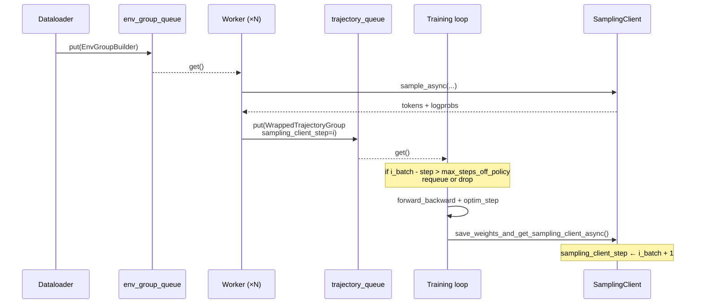
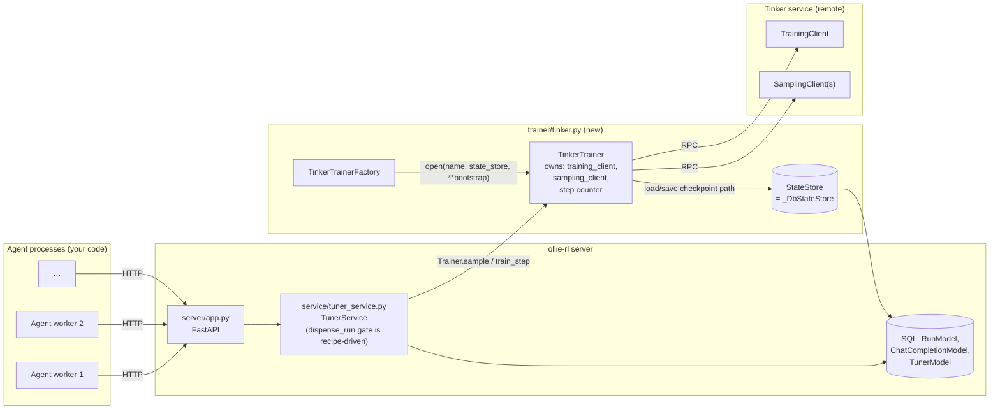
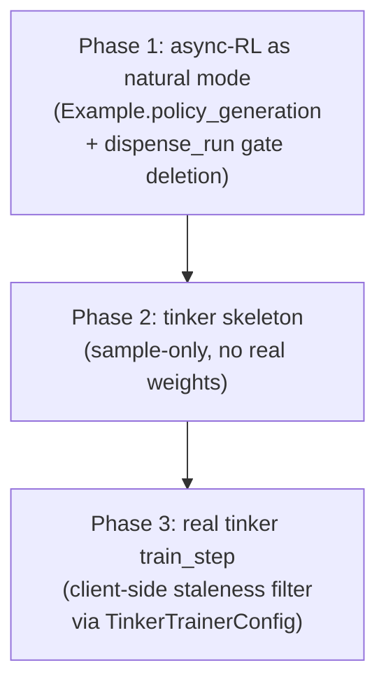

# Plan: Tinker Trainer for Async RL Agent Training

This is a **planning document** (not a spec) for integrating
[Tinker](https://tinker-docs.thinkingmachines.ai/) as a real `Trainer`
backend behind ollie-rl's existing `Trainer` / `TrainerFactory`
protocol, with first-class support for **async RL** (sampling and
training running concurrently against a streaming pool of rewarded
runs).

It is informed by the reference implementation in
[`tinker-cookbook/tinker_cookbook/recipes/harbor_rl`](https://github.com/thinking-machines-lab/tinker-cookbook/tree/main/tinker_cookbook/recipes/harbor_rl)
and especially the async training loop in
[`tinker_cookbook/rl/train.py`](https://github.com/thinking-machines-lab/tinker-cookbook/blob/main/tinker_cookbook/rl/train.py).

Read this **alongside**
[`data-model.md`](./data-model.md) and
[`sync-rl.md`](./sync-rl.md) — those describe the wire/data contract
this plan must preserve.

---

## TL;DR

- Implement `TinkerTrainer` + `TinkerTrainerFactory` in
  `src/ollie_rl/trainer/tinker.py`, registered under the name `"tinker"`
  (the same string the README already advertises in
  `POST /tuners { "trainer": "tinker" }`).
- Reuse the existing `Trainer` protocol **unchanged** at the method
  level. No new methods, no per-trainer capability flags.
- **Key reframing:** the `Trainer` protocol is already async-native.
  Both shipping backends (`gemini_msrl` and the future `tinker`)
  tolerate concurrent `sample()` and `train_step()` internally. What
  forces sync GRPO today is a single `is_training()` short-circuit in
  `TunerService.dispense_run` — and that short-circuit has **no
  correctness role**. It was a throughput proxy doing the wrong job at
  the wrong layer. Freshness is each trainer's concern, keyed off
  `policy_generation`.
- **No `Recipe` change.** Earlier drafts of this plan added an
  `allow_sample_during_train` flag; on reflection that flag was
  misleadingly named (it gates `dispense_run`, not `sample`) and not
  semantically necessary. The cleaner move is to delete the gate
  unconditionally and let trainers own off-policy semantics.
- **All mechanical async knobs live on per-trainer config.**
  `gemini_msrl` handles staleness server-side (the `TrainStepResponse`
  reports rejected candidates) and will surface a per-train-request
  promotion flag in a future API. `tinker` will enforce its own
  client-side staleness filter inside `TinkerTrainer.train_step` using
  `max_steps_off_policy` and `sampler_promotion_every` from
  `TinkerTrainerConfig`. Each backend owns its own off-policy
  mechanics — ollie-rl just hands trainers honest data.
- **Tiny protocol extension:** `Example` gains a `policy_generation:
  str` field (already on `ChatCompletionModel`, just plumbed through)
  so trainers that care about staleness can filter without DB access.
  `fake` and `gemini_msrl` ignore it; `tinker` uses it.
- **One TunerService change:** delete the `is_training()`
  short-circuit in `dispense_run`. Unconditional. `_collect_consumable_batch`
  is **not** touched. The `_train_lock` and `is_training()` check in
  `maybe_train` stay — those are *liveness* guards (don't fire two
  concurrent `train_step`s), not freshness.
- `num_groups_per_batch` continues to play the role of tinker's
  `AsyncConfig.groups_per_batch` — no new recipe knob needed for
  batch sizing.
- Persist tinker checkpoint state through the existing `StateStore`
  (already SQL-backed via `_DbStateStore` in `TunerService`).

The HTTP surface change is minor: `POST /tuners/{id}/runs` stops
returning `204 + Retry-After: 1` during training; it just keeps
issuing runs. DB schema does **not** change in Phase 1. A small
`ChatCompletionModel` column addition lands later with the real
tinker `train_step`. Async RL has an **immediate consumer** the day
Phase 1 lands: `gemini_msrl`, which is naturally off-policy and was
only being throttled by the now-deleted gate.

---

## Why this is needed

The README's roadmap promises a `tinker` trainer backend and the
"sidecar" pitch leans heavily on it. Today the registry only ships:

| Name              | Module                                  | Purpose             |
|-------------------|-----------------------------------------|---------------------|
| `fake`            | `src/ollie_rl/trainer/fake.py`          | Tests / local dev   |
| `gemini_msrl`     | `src/ollie_rl/trainer/gemini_msrl.py`   | Google MSRL backend |

Without a real local trainer, the sidecar story is unverifiable on
commodity GPUs and CI cannot exercise the end-to-end loop against a
backend that actually updates weights. Tinker is the obvious first
target because:

- Its `TrainingClient` / `SamplingClient` split maps cleanly onto
  ollie-rl's `Trainer.train_step` / `Trainer.sample`.
- `tinker_cookbook` already publishes a fully worked **async RL** loop
  (`do_async_training`), so we have a reference for *every* edge case
  (staleness, requeueing, off-policy thresholds, sampler-snapshot
  cadence).

---

## Reference: how tinker-cookbook does async RL

Trimmed read of
[`harbor_rl/train.py`](https://github.com/thinking-machines-lab/tinker-cookbook/blob/main/tinker_cookbook/recipes/harbor_rl/train.py)
and
[`rl/train.py`](https://github.com/thinking-machines-lab/tinker-cookbook/blob/main/tinker_cookbook/rl/train.py):

### The Tinker primitives

```python
# Bootstrap once:
training_client = service_client.create_lora_training_client(
    base_model=model_name, rank=lora_rank,
)

# Per training step:
metrics = await training_client.forward_backward_async(examples, loss_fn)
await training_client.optim_step_async(adam_params)

# Promote new weights into a sampler:
sampling_client = await training_client.save_weights_and_get_sampling_client_async()
# (or, for a durable checkpoint:)
path_dict = await checkpoint_utils.save_checkpoint_async(...)
sampling_client = training_client.create_sampling_client(path_dict["sampler_path"])

# Generate:
result = await sampling_client.sample_async(model_input, sampling_params)
```

### The async training architecture

`do_async_training` in `tinker_cookbook/rl/train.py` runs **four
coroutine groups** concurrently, communicating through two
`asyncio.Queue`s:

1. **Dataloader loop** — pushes `EnvGroupBuilder`s into
   `env_group_builders_queue` (bounded at `groups_per_batch`).
2. **Trajectory worker loops** — `groups_per_batch` workers run
   rollouts and push `WrappedTrajectoryGroup(trajectory_group,
   env_group_builder, sampling_client_step, …)` into
   `trajectory_groups_queue`.
3. **Training loop** — pops trajectory groups, runs a
   `filter_stale_trajectory_group()` predicate driven by
   `AsyncConfig.max_steps_off_policy`, accumulates
   `>= async_config.groups_per_batch` non-stale groups, then calls
   `forward_backward` + `optim_step` and refreshes `sampling_client`.
4. **Evaluation loop** — fires whenever
   `sampling_client_updated_event` is set.

### The async contract, in one sentence

> A rollout's `sampling_client_step` is stamped at sample time; the
> training loop discards or requeues any group whose stamp is more than
> `max_steps_off_policy` steps behind the current optimizer step, and
> only fires a `train_step` once enough non-stale groups have
> accumulated.



---

## How this maps onto ollie-rl

ollie-rl already has the dataloader, the workers, and the queues —
**they are HTTP clients**. Concretely:

| `tinker-cookbook/rl/train.py` primitive | ollie-rl equivalent |
|---|---|
| Dataloader loop | The client's outer loop that calls `POST /tuners/{id}/runs`. |
| `env_group_builders_queue` | `dispense_run` + the `datum_pool` table. |
| Trajectory worker loops | The client process(es) that drive `POST /openai/v1/chat/completions` and finally `PUT /reward`. |
| `WrappedTrajectoryGroup.sampling_client_step` | `ChatCompletionModel.policy_generation`, plumbed onto `Example.policy_generation` at batch-collection time. |
| `trajectory_groups_queue` | `RunModel` rows with `reward IS NOT NULL AND trained_count <= 0`. |
| Training loop / `filter_stale_trajectory_group` | **Owned inside `TinkerTrainer.train_step`**, not in `TunerService`. Driven by `TinkerTrainerConfig.max_steps_off_policy` against `Example.policy_generation`. (`gemini_msrl` does the equivalent server-side.) |
| `forward_backward` + `optim_step` | `Trainer.train_step(examples)`. |
| `save_weights_and_get_sampling_client_async()` | `train_op.wait()` resolution + a new sampler swap inside `TinkerTrainer`, cadence controlled by `TinkerTrainerConfig.sampler_promotion_every`. |
| `kl_reference_client` | Owned internally by `TinkerTrainer`; not exposed. |
| `Recipe.num_groups_per_batch` | Already present; same role as `AsyncConfig.groups_per_batch`. No other Recipe changes are required. |

**This is the central insight of the plan**: ollie-rl's HTTP surface
already implements the structure of the async training loop, and the
`Trainer` protocol is already async-native. We do not need to spin up
four coroutines inside the server — we need to (a) delete one
artificially synchronous gate in `dispense_run`, and (b) let each
trainer own its own off-policy semantics. The tinker integration adds
a trainer that knows how to filter stale `Example`s before calling
`forward_backward`; the `gemini_msrl` integration already has the
backend doing this for it.

---

## Architecture



### Module layout

```
src/ollie_rl/trainer/
├── tinker.py             # NEW — TinkerTrainer, TinkerTrainerFactory, register("tinker", …)
├── test_tinker.py        # NEW — unit tests with a fake tinker.ServiceClient
└── … (existing modules unchanged)
```

The factory is registered at import-time, exactly like `gemini_msrl`
and `fake`. We will also import `ollie_rl.trainer.tinker` from
`ollie_rl.trainer.__init__` so the registration happens at server
startup.

---

## Design: `TinkerTrainer`

### Persisted state (`TinkerTrainerState`)

Stored as JSON in `TunerModel.state` via the existing `_DbStateStore`:

```python
class TinkerTrainerState(BaseModel):
    # Tinker-side identity
    sampler_path: str          # latest saved sampler weights (also seeds restore)
    optimizer_path: str | None # latest full checkpoint (weights + opt state)

    # Async-RL bookkeeping
    train_step: int            # monotonically increasing; mirrors AsyncConfig step
    sampler_step: int          # train_step at which `sampler_path` was published

    # Backend config (frozen at create-time)
    base_model: str
    lora_rank: int
    learning_rate: float
    max_tokens: int
    temperature: float
    kl_penalty_coef: float
    loss_fn: str               # e.g. "importance_sampling"
```

`policy_generation` is wire-level the string serialization of
`sampler_step`. The existing `ChatCompletionModel.policy_generation`
column already stores this and needs no migration.

### Configuration (`TinkerTrainerConfig`)

Constructed in `TinkerTrainerFactory.open` from environment + the
`**bootstrap` kwargs that `TunerService.create_tuner` forwards
(eventually via `POST /tuners`):

| Field | Default / source | Purpose |
|---|---|---|
| `service_url` | env `TINKER_SERVICE_URL` | Tinker control plane. |
| `api_key` | env `TINKER_API_KEY` | Auth. |
| `base_model` | `bootstrap["base_model"]`, else `"meta-llama/Llama-3.1-8B-Instruct"` | LoRA base. |
| `lora_rank` | `bootstrap["lora_rank"]`, default 32 | LoRA adapter rank. |
| `learning_rate` | `bootstrap["learning_rate"]`, default `1e-5` | Adam LR. |
| `temperature` / `max_tokens` | bootstrap | Sampling defaults. |
| `kl_penalty_coef` | bootstrap, default `0.0` | Forwarded to `loss_fn_config`. |
| `loss_fn` | bootstrap, default `"importance_sampling"` | Tinker loss kind. |
| `max_steps_off_policy` | bootstrap, default 4 | **Tinker-specific** off-policy bound. Tinker filters stale `Example`s client-side inside `train_step` using this. (gemini_msrl does the equivalent server-side; fake ignores it.) |
| `sampler_promotion_every` | bootstrap, default 1 | Number of `train_step`s between sampler snapshots. 1 = promote after every step. Tinker-specific mechanical knob; not on Recipe. |

We deliberately keep `bootstrap` permissive (kwargs forwarded by
factory) to avoid a schema dance at this stage — the
`TinkerTrainerFactory` is the only place that needs to know these keys.

**Why these knobs are on `TinkerTrainerConfig` and not on `Recipe`:**
they are *mechanical* (how-to), not *algorithmic* (what-to). Different
backends interpret off-policy bounds differently — Gemini does it
server-side and reports rejections in `TrainStepResponse`; Tinker does
it client-side before `forward_backward`; future backends may handle
it some other way. Centralizing the knob on `Recipe` would force a
leaky abstraction. The `Recipe` only carries the single boolean that
says "this is an async-RL run" (see *Recipe surface changes* below).

### Implementing the protocol

```python
class TinkerTrainer(Trainer):
    async def sample(self, request: ChatCompletionRequest) -> SampleOp:
        # 1. Translate request.messages → tinker.ModelInput via the renderer.
        # 2. Use self._sampling_client (current snapshot) to call sample_async.
        # 3. Stamp Sample(policy_generation=str(self.state.sampler_step)).
        # 4. Wrap result in a TinkerSampleOp.

    async def train_step(self, examples: List[Example]) -> TrainOp:
        # 1. STALENESS FILTER (tinker-owned). Drop any Example whose
        #    int(policy_generation) < self.state.train_step
        #    - self.config.max_steps_off_policy.
        #    This is the client-side analogue of tinker-cookbook's
        #    filter_stale_trajectory_group; gemini_msrl gets the same
        #    effect server-side via TrainStepResponse rejections.
        # 2. If the surviving batch is too small, return a no-op TrainOp
        #    (do not bump train_step). TunerService already bumped
        #    trained_count optimistically — design choice: either
        #    (a) accept the implicit "drop" of those rows, or
        #    (b) extend TrainOp to surface the kept-vs-dropped set so
        #        TunerService can refund trained_count. Decide in Phase 3.
        # 3. Resolve each surviving Example.chat_completion_id → the
        #    tokens + logprobs cached at sample time (new column on
        #    ChatCompletionModel; see "Open questions" below).
        # 4. Build TensorData payload (see tinker_cookbook/rl/data_processing.py).
        # 5. Apply per-token advantage broadcast from Example.advantage.
        # 6. await self._training_client.forward_backward_async(...).
        # 7. await self._training_client.optim_step_async(...).
        # 8. If self.state.train_step % self.config.sampler_promotion_every == 0:
        #       new_sc = await self._training_client.save_weights_and_get_sampling_client_async()
        #       self._sampling_client = new_sc
        #       self.state.sampler_step = self.state.train_step
        # 9. Bump self.state.train_step, persist via state_store.

    async def in_flight_train_op(self) -> Optional[TrainOp]:
        # Return the most recently issued op until its .wait() resolves.
```

### Restore semantics

`TinkerTrainerFactory.open`:

1. `raw = await state_store.load()`.
2. If `raw is None` → bootstrap: create a fresh
   `service_client.create_lora_training_client(...)`, write an initial
   sampler snapshot, persist `TinkerTrainerState`.
3. Else → rehydrate the dataclass, call
   `service_client.attach_training_client(...)` or
   `create_training_client_from_checkpoint(...)` against
   `state.optimizer_path`, and
   `training_client.create_sampling_client(state.sampler_path)`.

This mirrors `GeminiMsrlTrainerFactory.open` (see the
`raw_state is None` branch) and stays inside the existing
`StateStore` contract.

---

## Design: async-RL inside `TunerService`

### One gate deletion, one new field on `Example`

The `Trainer` protocol is already async-native — both `tinker` and
`gemini_msrl` tolerate concurrent `sample()` while a `train_step` LRO
is in flight on the backend. The only thing forcing sync GRPO today
is a single gate in `TunerService.dispense_run`:

```python
# Today (sync-only):
if await trainer.is_training():
    return None
```

This gate has **no correctness role**. It was a throughput proxy:
"don't issue runs whose completions might end up stale." But every
backend that cares about staleness already handles it at the right
layer:

- `gemini_msrl` — server-side rejection in `TrainStepResponse`.
- `tinker` (future) — client-side filter inside `train_step` using
  `TinkerTrainerConfig.max_steps_off_policy`.
- `fake` — doesn't care; `policy_generation` never changes.

The proxy gate is doing the wrong job at the wrong layer. The
correct freshness key is `policy_generation`, owned by each trainer.
The whole TunerService change for async RL is therefore:

```python
# After (async-aware): the gate is gone, full stop.
# No recipe flag. No conditional. Just delete it.
```

…and **plumbing `policy_generation` through** to `Example` so trainers
can do their own off-policy filtering:

```python
# In ollie_rl/trainer/types.py:
class Example(BaseModel):
    chat_completion_id: str
    advantage: float
    policy_generation: str   # NEW
```

```python
# In _collect_consumable_batch:
examples = [
    Example(
        chat_completion_id=c.id,
        advantage=run_advantages[c.run_id],
        policy_generation=c.policy_generation,   # NEW
    )
    for c in completions
    if c.run_id in run_advantages
]
```

`_collect_consumable_batch` itself is **not** otherwise changed. There
is no central staleness filter, no new `cast(...)` SQL, no new method
on `Trainer`. Staleness is each backend's concern (see the
`TinkerTrainer.train_step` outline above).

### Why no Recipe flag?

Earlier drafts of this plan introduced a
`Recipe.allow_sample_during_train: bool` to control the gate. We
dropped it because:

1. The name was misleading — the flag controlled `dispense_run`, not
   `sample`. A more honest name (`allow_dispense_run_during_training`)
   underscored that the flag was about HTTP scheduling, not about an
   algorithmic mode.
2. The flag had no semantic role. Once trainers own freshness via
   `policy_generation`, neither sync GRPO nor async RL needs ollie-rl
   to gate dispense at all. Sync recipes that want strict on-policy
   training express it as a trainer-side bound (e.g.
   `max_steps_off_policy=0` on `TinkerTrainerConfig`), not as a
   service-level gate.
3. Existing backends gain throughput unconditionally — even
   `gemini_msrl` running a "sync" recipe stops sitting on `204
   Retry-After` responses during training.

If a future scenario genuinely needs strict gating at the TunerService
level (e.g. a deterministic regression test with the `fake` trainer),
that scenario can re-introduce the flag with a precise name and a
narrow scope. For now: simpler is better.

### What about requeueing?

In `tinker-cookbook`, stale groups can be requeued so the dataloader
re-rolls them. ollie-rl's natural analogue is simpler: a stale run is
abandoned. The trainer drops the stale `Example`s before
`forward_backward`; `TunerService` has already optimistically bumped
`trained_count` for those rows, so the runs are simply consumed
(stale or not). The existing `_pick_datum` "fewest pending+completed"
heuristic ensures the **datum** keeps getting fresh runs scheduled
naturally as workers ask.

If we ever want stricter requeue semantics, the right shape is to
extend `TrainOp` (or the result wrapper) so the trainer can report
back which `chat_completion_id`s were actually consumed; `TunerService`
can then refund `trained_count` on the dropped ones. Defer to
post-MVP — drop and re-issue is the simpler contract and matches the
"discard during shutdown" branch in `tinker-cookbook`'s
`filter_stale_trajectory_group`.

### What about tinker's `groups_per_batch`?

`tinker-cookbook`'s `AsyncConfig.groups_per_batch` says: accumulate
this many **non-stale** trajectory groups before firing
`forward_backward` + `optim_step`. ollie-rl already enforces the
"this many" half via `recipe.num_groups_per_batch` in
`_collect_consumable_batch`. The **non-stale** half is enforced inside
`TinkerTrainer.train_step` (after the client-side filter), which may
choose to return a no-op `TrainOp` if too few survive. Either way no
new recipe knob is needed — `num_groups_per_batch` covers the
ollie-rl side; the trainer covers the freshness side.

### Concurrent train + sample: the underlying observation

Today `maybe_train` is guarded by `self._train_lock` (process-wide),
and `dispense_run` returns `204` while `trainer.is_training()` is
true. The `_train_lock` is a genuine *liveness* guard (don't fire
two concurrent `train_step`s; `gemini_msrl` raises `RuntimeError` if
you try). It **stays**, along with the `is_training()` check in
`maybe_train`. Only the `dispense_run` short-circuit is removed.

Look at `GeminiMsrlSamplingOp.wait()`:

```python
return Sample(completion=completion, policy_generation=response.train_step_id)
```

The trainer stamps each sample with whatever `train_step_id` Gemini
returns. It never rejects a sample because training is in flight; it
just records the generation that produced it. Gemini's server-side
mechanics already filter stale candidates inside `TrainStepResponse`.
Tinker will do the same client-side. **So the only reason ollie-rl
currently runs synchronously is the one gate in `dispense_run`.** Lift
it and async RL falls out of the existing protocol for free, with no
recipe changes and no trainer protocol changes.

---

## Protocol surface changes

### `Recipe`: no changes

The `Recipe` shape stays exactly as it is today. We considered an
`allow_sample_during_train` (later renamed `allow_dispense_run_during_training`)
boolean and rejected it: the gate it would have controlled has no
correctness role, so a recipe flag would just be inherited complexity.
See *Why no Recipe flag?* in the previous section.

The existing knobs (`group_size`, `num_groups_per_batch`) are
sufficient for both sync and async use cases. A "sync" recipe is just
one driven by a trainer whose config holds `max_steps_off_policy=0`
(or whose backend filters server-side at zero tolerance); an "async"
recipe is the same recipe driven by a trainer with a positive bound.

### `Example`: one new field

The only protocol shape change is to the `Example` type that
`TunerService` hands to `Trainer.train_step`:

```python
# src/ollie_rl/trainer/types.py
class Example(BaseModel):
    chat_completion_id: str
    advantage: float
    policy_generation: str   # NEW — opaque sample-time stamp
```

Strictly additive. `fake` and `gemini_msrl` ignore the new field;
`tinker` uses it to drop stale rows before `forward_backward`.

### Recipe registrations (cookbook follow-up)

We can register a tinker-shaped recipe once Phase 2 lands, but it
needs no special fields:

```python
# Lands with Phase 2; shape mirrors harbor_rl's small-scale launch
# (group_size=4, groups_per_batch=8 in harbor_rl naming, which inverts
# to group_size=8, num_groups_per_batch=4 in our schema for the same
# 32-run batch).
TINKER_ASYNC_8x4 = Recipe(
    group_size=8,
    num_groups_per_batch=4,
)
```

`max_steps_off_policy` and `sampler_promotion_every` for the tinker
backend come from `TinkerTrainerConfig`, constructed from env +
`bootstrap` kwargs at `TrainerFactory.open` time. The recipe itself
stays pure data, backend-agnostic.

---

## Database changes

Cached sample tensors (for `forward_backward`) are not currently
stored — the `gemini_msrl` and `fake` trainers only need
`chat_completion_id` because Gemini's backend retains the candidate
internally. Tinker does not. We have three options:

1. **Add `tokens_blob` + `logprobs_blob` columns to
   `ChatCompletionModel`.** Cleanest; one extra binary column, written
   inside `TinkerTrainer.sample` via a callback on the trainer
   handed to `record_chat_completion`. Requires an Alembic migration
   (or, for the SQLite-by-default dev story, a `Base.metadata.create_all`
   delta plus an upgrade note).
2. **Add a tinker-specific side table** keyed by
   `chat_completion_id`. Keeps `ChatCompletionModel` minimal but adds
   a join.
3. **Re-sample at train time.** Avoid persistence; rerun the prompt
   through the saved sampler at `train_step` time. Cheaper schema-wise
   but doubles inference cost and breaks the "trained on the
   trajectory the agent actually saw" invariant.

**Recommendation**: option (1). Add nullable
`tokens` and `logprobs` BLOB columns to `ChatCompletionModel`; only
`TinkerTrainer` writes them; existing trainers ignore them. Schema
migration is a small follow-up PR.

This is the **one DB schema change** the plan calls for.

---

## Tests

Tests are split by responsibility. **TunerService** is responsible
only for plumbing; **each trainer** owns its own freshness policy.

- **TunerService dispense behaviour (integration, with `fake` trainer)**
  - With `trainer.is_training() == True`, `dispense_run` still
    returns a fresh `DispenseRun` (regression-guards the gate
    deletion). This replaces the old "returns `None` while
    training" test, which we expect to delete in Phase 1.
  - `Example` instances handed to `Trainer.train_step` carry
    `policy_generation` populated from `ChatCompletionModel`.
  - `_collect_consumable_batch` produces the same batch shape as
    today — no new SQL filter applied. Verifies we did **not**
    sneak a centralized staleness filter in by accident.

- **TunerService liveness (integration, with `fake` trainer)**
  - `maybe_train` still serializes on `_train_lock` + `is_training()`;
    two concurrent calls do not both fire `train_step`.

- **TinkerTrainer staleness filter (unit, fake `tinker.ServiceClient`)**
  - Construct a batch of `Example`s with `policy_generation`
    `"0".."3"`; set `state.train_step=3` and
    `config.max_steps_off_policy=1`. `train_step` must drop the
    rows from generation 0 and 1, and submit only the survivors to
    `forward_backward`.
  - `max_steps_off_policy` large enough that all rows survive → all
    are submitted.
  - Surviving batch falls below an internal threshold → trainer
    returns a no-op `TrainOp` and does **not** bump
    `state.train_step`.

- **TinkerTrainer lifecycle (unit, fake `tinker.ServiceClient`)**
  - `open()` from scratch persists initial state and creates a sampler.
  - `open()` from existing state rehydrates without recreating
    training_client.
  - `sample()` stamps `policy_generation == str(state.sampler_step)`.
  - `train_step()` increments `train_step` and (on cadence) promotes
    the sampler.
  - Crash mid-`train_step` (raise after `forward_backward`,
    before `optim_step`) leaves `state.train_step` unchanged.

- **End-to-end (HTTP, with `fake` trainer)**
  Existing `test_app.py` / `test_integration.py` patterns continue to
  apply. Add a coverage step that fires a long-running fake
  `train_step` and verifies the client can still call
  `POST /tuners/{id}/runs` and `POST /openai/v1/chat/completions`
  throughout. No tinker needed.

A live tinker smoke test belongs in a separate `tests/integration/`
directory gated by a `TINKER_API_KEY` env var (out of scope for the
default `uv run pytest` invocation; will be wired into a CI job later).

---

## Phased delivery



The reorder is deliberate. Async mode is **backend-agnostic** and has
an **immediate consumer** (`gemini_msrl` is naturally off-policy and
benefits from gate deletion the day Phase 1 lands). Landing it first
de-risks the protocol shape before any tinker SDK plumbing touches
the tree.

### Phase 1 — async-RL as the natural mode (1 PR) [COMPLETED]
No tinker code lands in this PR. Pure ollie-rl-side change. Real
consumers from day one: `fake` (tests) and `gemini_msrl` (production).

- Extend `Example` with `policy_generation: str` and plumb it through
  `_collect_consumable_batch` from `ChatCompletionModel.policy_generation`.
- **Delete** the `if await trainer.is_training(): return None`
  short-circuit in `TunerService.dispense_run`. Unconditional. No
  recipe flag, no per-tuner state change.
- Keep `_train_lock` and the `is_training()` check in `maybe_train`
  exactly as today — those are liveness guards, not freshness.
- **Do not** touch `_collect_consumable_batch`. No staleness filter,
  no SQL change.
- **Do not** add any new fields to `Recipe`. Existing cookbook entries
  (`grpo_16x32`) work as-is.
- Note the wire-behaviour change in the public docs:
  `POST /tuners/{id}/runs` no longer returns `204 + Retry-After: 1`
  during training. Existing clients that handle 204 will see fewer of
  them; none should break.
- Tests (see *Tests* above): TunerService dispense after gate
  removal; TunerService liveness still intact;
  `Example.policy_generation` populated.

### Phase 2 — tinker skeleton trainer (1 PR)
- `src/ollie_rl/trainer/tinker.py` with `TinkerTrainer`,
  `TinkerTrainerFactory`, `TinkerTrainerState`, `TinkerTrainerConfig`.
- Implements `sample()` against a tinker `SamplingClient`. Stamps
  `policy_generation = str(state.sampler_step)`.
- `train_step()` is a no-op that just persists state (so we can
  exercise the registration and HTTP flow with a real tinker
  endpoint, including in async mode).
- Add `tinker` to `pyproject.toml` via `uv add tinker` (or pin to a
  specific version). Make it an **optional** dependency group so the
  current minimal install does not pull it in.
- Register `"tinker"` in `trainer/factory.py`.
- Tests: factory create/restore round-trip; sample stamps a
  `policy_generation`.

### Phase 3 — real tinker `train_step` (1 PR)
- Add `tokens` + `logprobs` columns to `ChatCompletionModel` (Alembic
  migration + model bump).
- `TinkerTrainer.sample()` writes those blobs into a side cache that
  `TunerService.record_chat_completion` flushes.
- `TinkerTrainer.train_step()`:
  1. Applies the client-side staleness filter using
     `Example.policy_generation`, `state.train_step`, and
     `config.max_steps_off_policy`.
  2. Builds the `forward_backward` payload from cached tokens/logprobs
     and `Example.advantage`.
  3. Runs `optim_step`.
  4. Promotes the sampler every `config.sampler_promotion_every`
     steps.
- Tests: in-trainer staleness filter (`config.max_steps_off_policy`
  drops the right rows); end-to-end one batch on a fake tinker
  service that validates the payload shape.

Each phase is shippable independently. Phase 1 alone unlocks
async-mode `gemini_msrl`. Phase 1+2 deliver a working (no-op
training) tinker registration that can be exercised end-to-end against
a real tinker endpoint. Phase 3 closes the loop.

---

## Future work: strict sync mode

Deleting the `dispense_run` gate unconditionally in Phase 1 makes
*async* the natural mode. A future recipe may want **strict sync mode**
— zero off-policy tolerance, where every `Example` consumed by
`train_step` was sampled against the exact policy generation being
trained. This is *additive* on top of Phase 1, not a regression: the
gate is re-introduced behind an opt-in flag, plus two new pieces of
machinery.

The three pieces:

1. **Preventive (start-gate).** Re-introduce the "disallow
   `dispense_run` during training" check, but opt-in — driven by e.g.
   `Recipe.allow_dispense_during_training: bool = True` (set to `False` to
   prevent *new* runs from starting on a policy that's about to be replaced).

2. **Active (interrupt-in-flight).** Cancel `sample()` ops that are
   still in flight when `train_step` fires, and mark their parent runs
   as dropped. This is *new capability*: today `Trainer.sample()`
   returns an op you await, with no cancellation path. Two
   implementation options:
   - Add `SampleOp.cancel()` to the `Trainer` protocol (backends
     opt-in; tinker can cancel via `SamplingClient`; `gemini_msrl`
     abandons the LRO).
   - Server-side only: `TunerService` cancels the awaiting asyncio
     task and marks the `RunModel` as dropped, letting the backend op
     complete and discarding its result.

3. **Wire contract.** The dropped run needs to be communicated back to
   the client. Cleanest shape: the in-flight `chat/completions` call
   returns an error (e.g. `409 Conflict` "run cancelled by policy
   promotion") and the cookbook client treats it as "this run is dead,
   skip to next batch item".

**Multi-turn nuance.** For agentic / multi-turn runs, "drop the run"
is the *only* consistent choice — you cannot have turn 1 on policy
*N* and turn 3 on policy *N+1* in the same trajectory. Single-turn
runs could in principle just retry on the new policy, but treating
both the same (drop) keeps the contract uniform.

None of this lands in Phase 1–3. Captured here so the design intent
isn't lost: when a real strict-sync consumer appears, it builds on the
Phase 1 boundary rather than reverting it.

---

## Open questions (decide before phase 3)

1. **Where do tokens/logprobs live?** Column on `ChatCompletionModel`
   vs. side table (see "Database changes"). Default
   recommendation: column.

2. **Do we persist tinker checkpoint paths globally or per-tuner?**
   The proposal stores them in `TunerModel.state` (per-tuner). This
   matches `gemini_msrl`'s pattern. Cross-tuner sharing (e.g. starting
   from a tuned checkpoint) is a future feature.

3. **How is `base_model` chosen at tuner-creation time?** The HTTP
   surface today accepts `recipe` and `trainer` but no
   trainer-specific args. Options:
   - (a) Add an optional `trainer_args: dict[str, Any]` to
     `CreateTunerRequest`. Plumbs through to
     `TrainerFactory.open(..., **bootstrap)`.
   - (b) Resolve `base_model` from environment / a server config.
   - (c) Make it a property of the recipe (e.g.
     `TINKER_LLAMA_8B_ASYNC`).
   Recommendation: **(a)**. It's the minimum-surface way to let the
   client decide and matches how `gemini_msrl` already reads
   `bootstrap`.

4. **Sampler promotion cadence vs. checkpoint cadence.** Tinker
   distinguishes a cheap "sampler weights only" snapshot from a full
   checkpoint (weights + optimizer state). Plan: promote sampler every
   `sampler_promotion_every` train steps; full-checkpoint cadence is a
   `TinkerTrainerConfig` field (default every 20 train steps, matching
   `tinker-cookbook`'s `save_every=20`). Both are internal to the
   trainer; not exposed on the recipe.

5. **KL reference policy.** `tinker-cookbook` supports an optional
   reference sampler (`KLReferenceConfig`). For MVP we wire
   `kl_penalty_coef=0.0` and document that the reference is the base
   model. Adding a real reference is a phase-5 follow-up.

6. **Renderer/tokenizer.** Sampling requires turning
   `ChatCompletionRequest.messages` into `tinker.ModelInput`. Lean on
   `tinker_cookbook.renderers.get_renderer` keyed off `base_model`;
   instantiate once at `TinkerTrainerFactory.open` time and reuse.

---

## Where to read more

- Reference recipe (HarborTask + async config wiring):
  [`tinker_cookbook/recipes/harbor_rl/train.py`](https://github.com/thinking-machines-lab/tinker-cookbook/blob/main/tinker_cookbook/recipes/harbor_rl/train.py)
- The async training loop (the soul of this plan):
  [`tinker_cookbook/rl/train.py` `do_async_training`](https://github.com/thinking-machines-lab/tinker-cookbook/blob/main/tinker_cookbook/rl/train.py)
- Trajectory → training data conversion (what tinker
  `forward_backward` actually consumes):
  [`tinker_cookbook/rl/data_processing.py`](https://github.com/thinking-machines-lab/tinker-cookbook/blob/main/tinker_cookbook/rl/data_processing.py)
- Existing ollie-rl trainer references:
  `src/ollie_rl/trainer/types.py`,
  `src/ollie_rl/trainer/gemini_msrl.py` (closest existing analogue),
  `src/ollie_rl/trainer/fake.py`.
- The contract this plan must preserve: `data-model.md`, `sync-rl.md`.

When in doubt, prefer **minimal additions to the existing protocol**
and **let each trainer own its own off-policy mechanics**. The
`Recipe` stays backend-agnostic (`group_size`, `num_groups_per_batch`,
nothing async-specific); backend knobs (`max_steps_off_policy`,
`sampler_promotion_every`, sampler-promotion strategy) live on
per-trainer config where they can't lie to the other backends; and
freshness is propagated through `Example.policy_generation` rather
than enforced by a TunerService-level gate.
