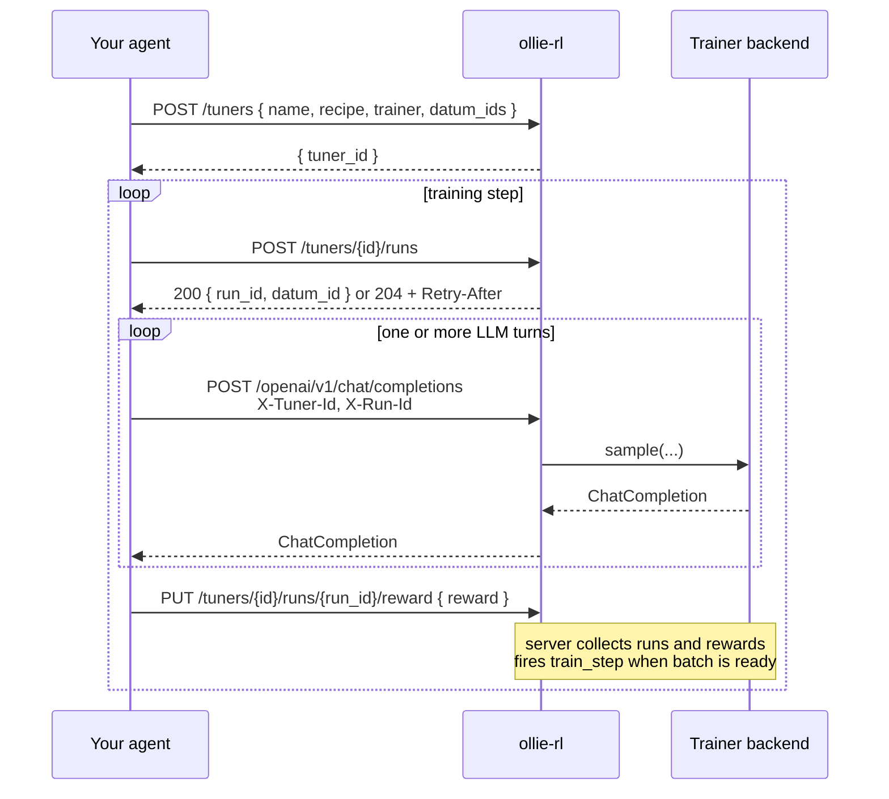

<h1 align="center">🛹 ollie-rl</h1>

<p align="center">
  <strong>Fine-tune the agent you already have — by pointing it at a new URL.</strong><br/>
  An OpenAI-compatible chat-completions server with a built-in online GRPO loop.
</p>

<p align="center">
  <a href="https://github.com/wsxiaoys/ollie-rl/actions/workflows/ci.yml"></a>
  <a href="https://github.com/wsxiaoys/ollie-rl/actions/workflows/docker-publish.yml"></a>
  <a href="LICENSE"></a>
  <a href="https://github.com/wsxiaoys/ollie-rl/pkgs/container/ollie-rl"></a>
  
  
</p>

---

## Train your agent. Not your training loop.

Your agent already speaks one universal protocol — `POST /v1/chat/completions` —
and it already has a notion of success (test passed, task completed, user
thumbs-up). `ollie-rl` is the **drop-in sidecar** that turns those two things
into an online GRPO training signal. **Zero agent code changes.**

**What you don't have to write:**

- ❌ A rollout collector
- ❌ A dataset loader / replay buffer
- ❌ An offline training script
- ❌ A custom RL framework integration per agent

**What you write:**

- ✅ A reward function (one `PUT` per task)
- ✅ A list of `datum_id`s (your prompts / tasks)

That's it. Any agent that can change its OpenAI base URL — LangGraph, CrewAI,
OpenCode, `inspect-ai`, ACP, your homebrew loop — becomes an RL training
driver. The server forms GRPO groups, computes advantages, and fires
`train_step`s on a pluggable backend (`tinker` and custom backends) on your
behalf.

## 30-second demo: train OpenCode CLI

[OpenCode CLI](https://opencode.ai) is an open-source terminal agent. Without
patching a single line of OpenCode, you can fine-tune the policy it drives by
adding one provider block to `opencode.json`:

```json
{
  "$schema": "https://opencode.ai/config.json",
  "model": "ollie/tinker",
  "provider": {
    "ollie": {
      "npm": "@ai-sdk/openai-compatible",
      "name": "ollie-rl",
      "options": {
        "baseURL": "http://localhost:8000/openai/v1",
        "apiKey": "any-key",
        "headers": {
          "X-Tuner-Id": "{env:TUNER_ID}",
          "X-Run-Id":   "{env:RUN_ID}"
        }
      },
      "models": { "tinker": {} }
    }
  }
}
```

Then drive the GRPO loop from your shell — create a tuner once, then request
a run, let the agent solve the task, and score it:

```bash
# One-time: create a tuner over your task list
TUNER_ID=$(curl -s -X POST http://localhost:8000/tuners \
  -H 'Content-Type: application/json' \
  -d '{"name":"my-policy","recipe":"grpo_16x32","trainer":"tinker","datum_ids":["task-1","task-2","task-3"]}' \
  | jq -r .tuner_id)

# Per run: request a run assignment
RUN=$(curl -s -X POST http://localhost:8000/tuners/$TUNER_ID/runs)
export TUNER_ID
export RUN_ID=$(jq -r .run_id  <<< "$RUN")
DATUM_ID=$(jq   -r .datum_id <<< "$RUN")

# Run the agent against the live (and learning) policy
opencode run "Solve this task: $DATUM_ID"

# Score the run — the server learns from it implicitly
curl -X PUT http://localhost:8000/tuners/$TUNER_ID/runs/$RUN_ID/reward \
  -H 'Content-Type: application/json' \
  -d '{"reward": 1.0}'
```

Loop the per-run block. Every **16** scored runs of a given prompt form a GRPO group;
every **32** groups (= 512 runs) trigger a `train_step` automatically. Your
agent is being fine-tuned while it's being used.

## How it works



Concepts the server hides for you:

- **Tuner** — one live training job; owns a policy and a `datum_pool`.
- **Run** — one attempt at a `datum_id`; carries the scalar reward.
- **Rollout** — a GRPO group of K runs sharing the same `datum_id`.
- **Recipe** — declarative knobs (`group_size`, `num_groups_per_batch`).
- **Trainer** — the pluggable backend (`tinker`, or your own).

For the full data model, see
[`data-model.md`](./.agents/skills/dev/references/data-model.md).
For the wire protocol, see
[`sync-rl.md`](./.agents/skills/dev/references/sync-rl.md).

## Run the server

Boot ollie-rl on `http://localhost:8000` (Swagger UI at `/docs`) and the
demo above is ready to go:

```bash
docker compose -f deploy/docker-compose.yaml up -d
```

Or from source, for local development:

```bash
uv sync
uv run poe dev
```

## How does this compare to `trl` / `verl` / `OpenRLHF`?

| | `ollie-rl` | `trl` / `verl` / `OpenRLHF` |
|---|---|---|
| **Interface** | HTTP, OpenAI-compatible | Python script |
| **Drives your agent loop** | ✅ yes — bring your own | ❌ you write a rollout collector |
| **Online (sample ↔ train)** | ✅ implicit GRPO | ✅ (with effort) |
| **Pluggable backend** | ✅ via `TrainerFactory` | varies |
| **Framework-agnostic clients** | ✅ any OpenAI client | ❌ Python only |
| **Status** | experimental | mature |

`ollie-rl` is not a replacement for `trl` — it's the **sidecar layer above
it**. You can imagine plugging `trl`, `verl`, or any custom trainer in behind
the `Trainer` protocol.

## Architecture

```
src/ollie_rl/
├── server/      FastAPI HTTP surface
├── service/     TunerService — dispense_run, advantage math, maybe_train
├── trainer/     Pluggable Trainer / TrainerFactory protocol
│   ├── types.py    The plugin contract
│   └── factory.py  Registry of registered TrainerFactories
├── cookbook/    Declarative `Recipe`s (group_size, num_groups_per_batch, …)
├── db/          SQLAlchemy async models (SQLite by default, Postgres-ready)
└── types.py     HTTP DTOs
```

## Configuration

| Env var | Default | Purpose |
|---|---|---|
| `DATABASE_URL` | `sqlite+aiosqlite:///./data/db.sqlite` | SQLAlchemy async URL. Switch to `postgresql+asyncpg://...` for prod. |

## Status & Roadmap

`ollie-rl` is **pre-1.0 / experimental**. The HTTP surface is intentionally
small and is still evolving.

Planned:

- [ ] A `tinker` trainer backend.
- [ ] An auto-research prompt-optimization backend — a `Trainer` that, instead
      of updating weights, evolves the system prompt from rewarded rollouts
      (think GEPA / OPRO / DSPy-style optimizers) behind the same HTTP surface.
- [ ] A runnable end-to-end `examples/` directory with reward curves.
- [ ] Documentation website.
- [ ] Lightweight `ollie-rl-client` Python SDK on PyPI.
- [ ] vLLM / SGLang trainer adapters.
- [ ] Multi-step scheduler + reward replay.

See [`ROADMAP.md`](./ROADMAP.md) once it lands, or browse
[the issues](https://github.com/wsxiaoys/ollie-rl/issues).

## Development

```bash
uv sync --all-groups
pre-commit install --hook-type pre-commit --hook-type pre-push

uv run poe test          # pytest
uv run poe check         # ty type-check
uv run poe lint          # ruff
uv run poe format        # ruff fix + uv format
uv run poe dev           # uvicorn reload server
```

See [`CONTRIBUTING.md`](./CONTRIBUTING.md) for the full contributor guide.
