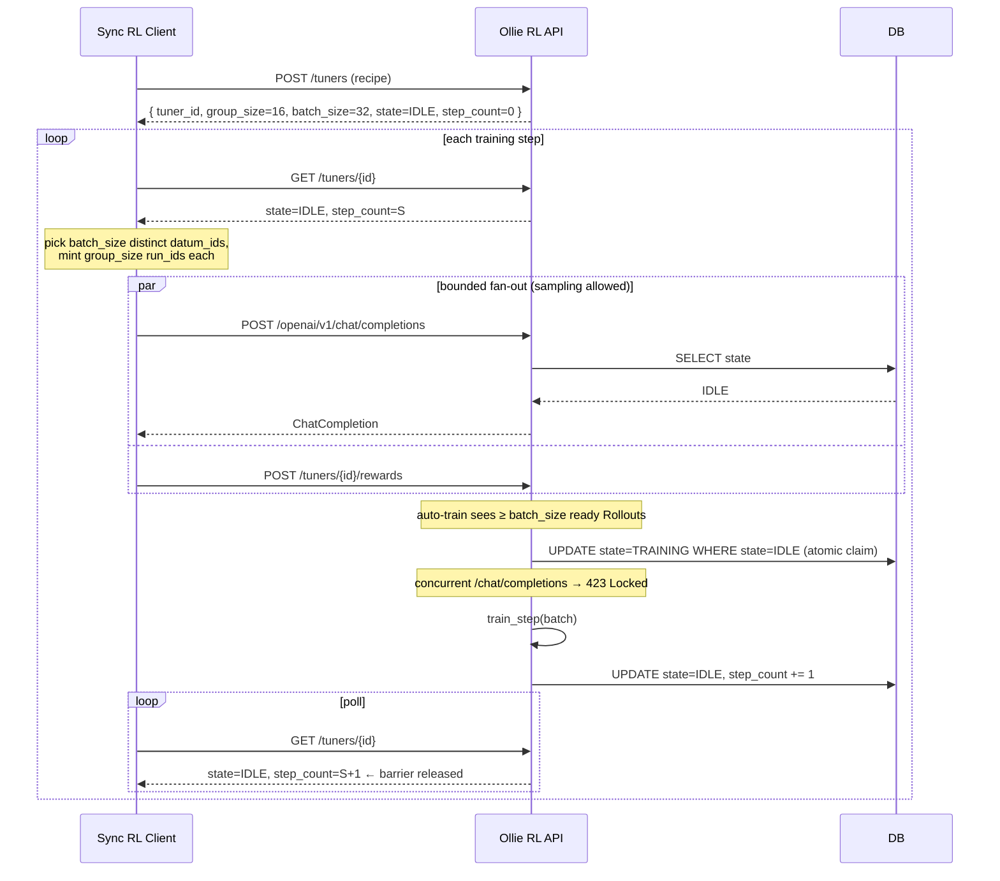

# API Design — Sync RL Barrier & Future-Proofing

Working doc for the next round of changes to the Ollie RL api server. Goal:
make the public HTTP surface correct for **synchronous GRPO** (rollout
must pause while training is in flight) while keeping the door open for
future **async / disaggregated-sampler** recipes without a schema break.

This document is a design proposal — nothing has been implemented yet.
It exists to make the discussion easier to iterate on in PR review.

Status: **draft, awaiting sign-off before implementation**.

---

## 1. Problem

Today the loop is implicitly async:

- Clients post chat completions and rewards whenever.
- `TunerService.train` opportunistically grabs 32 ready `Rollout`s and
  trains.
- Sampling and training run against the same `Tuner` object with **no
  coordination**.

Two things are missing:

1. **Mutual exclusion** — when a training step is in flight, sync RL
   wants `/openai/v1/chat/completions` to be blocked (or at least
   refused) so we don't sample from a half-updated policy.
2. **Sizing** — the client owns rollouts, but it has no way to know how
   many runs make one training step. `GROUP_SIZE = 16` and
   `TARGET_GROUP_COUNT = 32` live as private constants in
   `tuner_service.py`.

Plus: we want the design to remain valid when a future recipe wants to
**allow sampling during training** (async actor / vLLM-served snapshot
/ Tinker-style decoupled sampler).

---

## 2. Mental model

Two orthogonal concerns we keep conflating today:

| Question                                          | Owner                   | Mechanism                                          |
|---------------------------------------------------|-------------------------|----------------------------------------------------|
| When is a training step happening?                | server                  | `TunerModel.state`, `step_count`, atomic DB claim  |
| Is sampling allowed right now?                    | recipe (`Tuner`)        | `Tuner.allows_sampling_during_training` (admission)|
| Which policy did a sample come from?              | server (recorded)       | `ChatCompletionModel.policy_generation`            |
| How stale a sample may be                         | recipe                  | `SamplingPolicy` (future)                          |

The sync GRPO recipe answers question 2 with "no". Future async recipes
answer "yes, with a staleness bound". The **server** never has to know
which.

---

## 3. Decisions captured from discussion

| # | Decision                                                                                       | Rationale                                                  |
|---|------------------------------------------------------------------------------------------------|------------------------------------------------------------|
| 1 | Server publishes `group_size` and `batch_size` per tuner.                                      | Client owns the dataset, needs to know how many runs/step. |
| 2 | Mutual exclusion via **DB column**, not in-process `asyncio.Lock`.                             | Naturally multi-client / multi-process safe.               |
| 3 | Training trigger stays **auto-train** (kept for future async use case).                        | Same code path serves both sync and async drivers.         |
| 4 | Multi-driver safety comes for free from atomic `UPDATE … WHERE state='IDLE'`.                  | No new lease/locking infrastructure.                       |
| 5 | Admission ("can I sample now?") is delegated to the `Tuner` / recipe.                          | Future async recipes opt in without API changes.           |
| 6 | Add `ChatCompletionModel.policy_generation` now even though sync GRPO ignores it.              | Cheap insurance; schema churn later is painful.            |

---

## 4. Surface changes

### 4.1 `TunerModel` (DB)

Add:

| column          | type                                  | default | meaning                                     |
|-----------------|---------------------------------------|---------|---------------------------------------------|
| `state`         | `Literal["IDLE","TRAINING"]`          | `IDLE`  | lifecycle of the next training step         |
| `step_count`    | `int`                                 | `0`     | number of completed training steps          |
| `group_size`    | `int`                                 | recipe  | runs per `Rollout` (was `GROUP_SIZE`)       |
| `batch_size`    | `int`                                 | recipe  | rollouts per step (was `TARGET_GROUP_COUNT`)|

`group_size` / `batch_size` are sourced from the recipe at
`create_tuner` time and persisted so they survive restarts.

### 4.2 `ChatCompletionModel` (DB)

Add:

| column              | type   | default                   | meaning                                                |
|---------------------|--------|---------------------------|--------------------------------------------------------|
| `policy_generation` | `int`  | `tuner.step_count` at sample | which trained policy generation this sample came from |

Sync GRPO never reads it. Async recipes use it for staleness filtering
/ off-policy correction.

### 4.3 `Tuner` (in-process)

Add one new property (single hook, default-safe):

```python
class Tuner(...):
    @property
    def allows_sampling_during_training(self) -> bool:
        return False  # safe default for sync GRPO
```

Async recipes override → `True`. Later we can promote this to a richer
`admit_sample(ctx) -> SampleAdmission` without breaking callers.

### 4.4 HTTP endpoints

#### `POST /tuners` — response extended

```jsonc
{
  "tuner_id": "tuner_…",
  "name": "…",
  "recipe": "gemini_msrl",
  "group_size": 16,
  "batch_size": 32,
  "state": "IDLE",
  "step_count": 0
}
```

#### `GET /tuners/{tuner_id}` — **new**

Same shape as the create response. This is the **barrier endpoint** the
sync client polls.

#### `POST /openai/v1/chat/completions` — behavior change

Before sampling:

```python
state, step_count = await tuner_service.get_state(tuner_id)
if state == "TRAINING" and not tuner.allows_sampling_during_training:
    raise HTTPException(
        status_code=423,
        headers={"Retry-After": "1"},
        detail="Tuner is in TRAINING state.",
    )
```

When recorded:

```python
ChatCompletionModel(
    id=completion.id,
    tuner_id=…,
    run_id=…,
    datum_id=…,
    policy_generation=step_count,   # NEW
)
```

#### `POST /tuners/{tuner_id}/rewards` — unchanged

### 4.5 `TunerService.train()`

Wrap the existing body in an atomic claim:

```python
async with self.async_session() as session, session.begin():
    claimed = await session.execute(
        update(TunerModel)
        .where(TunerModel.id == tuner_id, TunerModel.state == "IDLE")
        .values(state="TRAINING")
    )
    if claimed.rowcount == 0:
        return  # another worker owns this step

try:
    # … existing collect_rollout_ready_for_training + train_step.wait() …
finally:
    async with self.async_session() as session, session.begin():
        await session.execute(
            update(TunerModel)
            .where(TunerModel.id == tuner_id)
            .values(state="IDLE", step_count=TunerModel.step_count + 1)
        )
```

### 4.6 Startup recovery

In the FastAPI lifespan startup, reset stuck rows:

```sql
UPDATE tuners SET state = 'IDLE' WHERE state = 'TRAINING';
```

so a crash during `train_step` does not deadlock the tuner.

---

## 5. Client flow (sync mode)



The async client flow is the **same surface**:

- Same `POST /tuners`, same chat-completion and reward endpoints.
- During a step, sampling gets `423` **only if**
  `tuner.allows_sampling_during_training` is `False`. Async recipes flip
  it to `True` and never see `423`.
- `policy_generation` on every completion lets the trainer reason about
  staleness.

---

## 6. Known race (accepted, documented)

A sample request that has *already passed* the `SELECT state` check can
finish a few ms after `train()` flips the state to `TRAINING`. Its
completion still gets recorded under the old policy and will participate
in a *future* training step.

This is the same off-policyness GRPO already tolerates (rollouts in
flight when training starts have always existed); not worth extra
plumbing in v1. Document it in `sync-rl.md`.

If a future recipe is strict about this, it can:

- Re-check `state` after `sample_op.wait()` and discard the result, or
- Use `policy_generation` to filter at `train_step` time.

---

## 7. Implementation plan

### 7.1 Ship in the sync-RL PR

1. **DB schema**
   - `TunerModel`: add `state`, `step_count`, `group_size`, `batch_size`.
   - `ChatCompletionModel`: add `policy_generation`.
2. **Recipe wiring**
   - Each `Cookbook` recipe exposes `group_size` / `batch_size` (default
     16 / 32). `create_tuner` reads them and persists them.
3. **`TunerService`**
   - Read sizes from `TunerModel` instead of module constants.
   - New `get_state(tuner_id)` returning `(state, step_count,
     group_size, batch_size)`.
   - `train()` wraps body in atomic claim + `try/finally` release.
   - Startup recovery hook.
4. **`Tuner` admission hook**
   - `Tuner.allows_sampling_during_training: bool = False`.
5. **HTTP**
   - Extend `POST /tuners` response.
   - New `GET /tuners/{tuner_id}`.
   - 423 admission check in `_generate_chat_completion`.
   - Stamp `policy_generation` on recorded completions.
6. **Docs**
   - Update `.agents/skills/dev/references/sync-rl.md` with the barrier
     loop and `423 Locked` semantics.
   - Update `.agents/skills/dev/references/data-model.md` with the new
     fields and the "lifecycle vs admission" split.
   - Add a short "Future: async recipes" subsection in both.
7. **Tests** (after design + impl sign-off, per AGENTS.md)
   - Atomic claim race (two concurrent `train()` calls → exactly one
     wins).
   - 423 returned during `TRAINING`.
   - `step_count` monotonicity across steps.
   - Startup recovery from a `TRAINING`-stuck row.
   - `policy_generation` recorded correctly on completions.

### 7.2 Defer until a real async recipe drives the requirement

8. Promote `allows_sampling_during_training: bool` to
   `SamplingPolicy(allow_during_training, max_generation_staleness,
   retry_after_s)`.
9. Promote the property to `Tuner.admit_sample(ctx) -> SampleAdmission`
   (richer hook returning generation + retry-after).
10. Staleness-aware `collect_rollout_ready_for_training` (drop or weight
    by staleness).
11. Off-policy correction (importance ratios) inside `train_step`.

---

## 8. Open questions

| #  | Question                                                                                                  | Default if no answer                                                |
|----|-----------------------------------------------------------------------------------------------------------|---------------------------------------------------------------------|
| Q1 | Should `Retry-After` be a fixed `1s` or recipe-tunable?                                                   | Fixed `1` in v1; promote later.                                     |
| Q2 | Should `GET /tuners/{id}` also return last-step timing for client-side ETA?                               | No (out of scope).                                                  |
| Q3 | Do we want an **explicit** `POST /tuners/{id}/train` nudge endpoint, or rely solely on auto-train?         | Rely on auto-train; add nudge later only if polling latency hurts.  |
| Q4 | Where does auto-train get *triggered* — post-reward hook, background task, or both?                       | Hook on reward submission (cheapest); can add a periodic task later.|
| Q5 | Should `policy_generation` also be added to `RewardModel` (so we can filter without joining completions)? | Skip in v1; only completions need it for off-policy math.           |

---

## 9. Why this factoring is the right one

- **Sync GRPO is correct by default**: `allows_sampling_during_training
  = False` ⇒ `423` during a step.
- **Async recipes are a one-line opt-in**: override the property; no
  schema migration, no new endpoints.
- **The server stays dataset-agnostic**: it only ever publishes sizes;
  the client still owns `datum_id`s and `run_id`s.
- **Multi-driver safety is intrinsic**: atomic DB claim handles all the
  race conditions without per-process locks.
- **Off-policy correction is unlocked later**: `policy_generation` is
  already on the wire / in the DB by the time the first async recipe
  arrives.

---

## 10. Non-goals (intentionally out of scope for this iteration)

- Persistent leases / heartbeat-based stale-lock recovery — startup
  reset is sufficient for now.
- Server-side rate limiting on `/chat/completions` — sync clients
  self-throttle.
- Server-driven curriculum (server picking `datum_id`s) — client still
  owns the dataset.
- Distributed trainer / multi-worker `train_step` execution — the
  atomic claim makes it future-compatible, but actual implementation is
  deferred.
