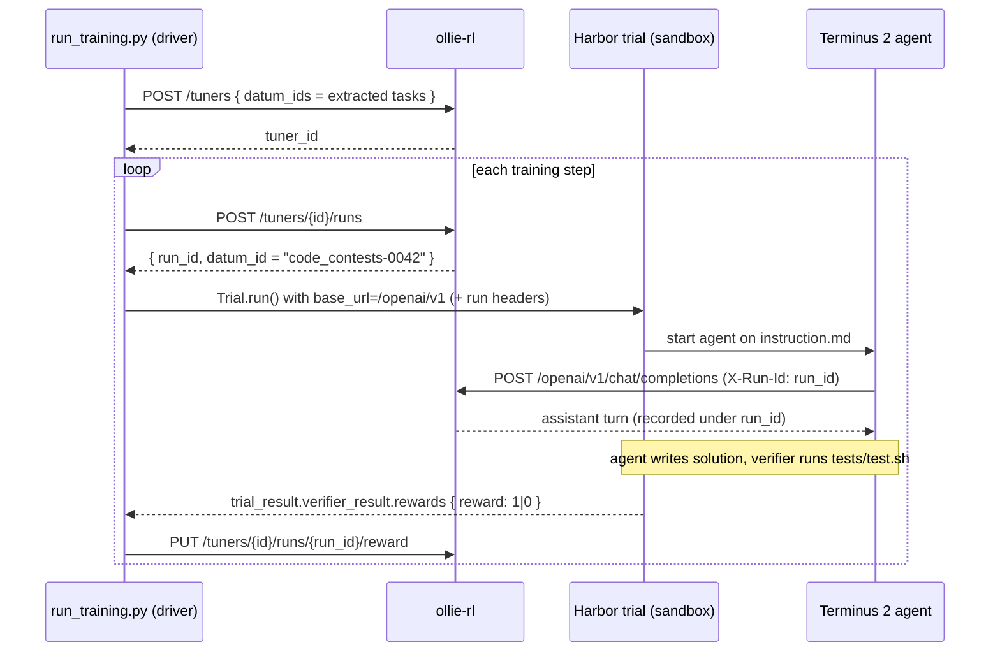

# CodeContests — Harbor + ollie-rl RL Example

Reinforcement learning on **containerized competitive-programming tasks** using
[Harbor](https://www.harborframework.com/docs/training-workflows/rl) as the
rollout environment and `ollie-rl` (pochi) as the tuner/trainer.

Each rollout is a full **Harbor trial**: a [Terminus 2](https://www.harborframework.com)
agent is dropped into a sandboxed container, reads a CodeContests problem,
writes a solution, and Harbor's verifier runs the task's unit tests to produce
the reward. `ollie-rl` records the agent's LLM calls and trains on them, using
a containerized agentic environment instead of a shell-out to `opencode`.

```
examples/code-contests/
├── prepare_data.py     ← extracts open-thoughts/CodeContests into Harbor tasks
├── run_training.py     ← the driver (create tuner, run trials, score rewards)
├── tasks/              ← (generated) one Harbor task dir per datum_id
└── trials/             ← (generated) Harbor per-trial working dirs / logs
```

## The dataset is already in Harbor format

Every row of
[`open-thoughts/CodeContests`](https://huggingface.co/datasets/open-thoughts/CodeContests)
is `{ path, task_binary }`, where `task_binary` is a **gzipped tarball of a
complete Harbor task directory**:

```
code_contests-0000/
├── task.toml            # [agent]/[verifier] timeouts, metadata
├── instruction.md       # the problem statement given to the agent
├── environment/
│   └── Dockerfile       # the sandbox the agent works in
└── tests/
    ├── test.sh          # runs the graders, writes /logs/verifier/reward.txt
    ├── test_state.py
    └── test_data.json   # the problem's I/O test cases
```

So "conversion" is just extraction — `prepare_data.py` decodes + gunzips +
untars each row into `tasks/<path>/`. Each extracted directory is one Harbor
task, and its `path` (e.g. `code_contests-0000`) is used verbatim as an
`ollie-rl` **`datum_id`**.

## Concept mapping

| Harbor | ollie-rl / pochi | In this example |
|---|---|---|
| `TaskConfig(path=…)` | `datum_id` | one CodeContests problem |
| one trial → reward | **Run** (one attempt at a `datum_id`) | one Terminus 2 solve attempt |
| K trials of the same task | **Rollout** (a GRPO group) | `group_size` (16) attempts / problem |
| `verifier_result.rewards["reward"]` | `PUT /reward` payload | pass/fail from `tests/test.sh` |
| agent `base_url` (LLM endpoint) | ollie-rl OpenAI-compatible endpoint | shared endpoint below |

Because Terminus 2 samples through ollie-rl's endpoint, **token collection is
automatic**. Harbor is used purely for the sandbox, the agent loop, and the
verifier reward.

## The shared LLM endpoint

Every trial shares one static `base_url` pointing at ollie-rl's
OpenAI-compatible endpoint:

```
http://<ollie-host>/openai/v1
```

The per-run attribution travels in HTTP headers (`X-Tuner-Id` / `X-Run-Id`),
which the driver injects via Terminus 2's `extra_headers` LLM kwarg, so ollie-rl
records every completion under the right run.

## How it fits together



## Prerequisites

1. **ollie-rl server** running on `http://localhost:8000`:

   ```bash
   uv sync
   uv run poe dev
   ```

2. **Harbor** installed with a container backend (local `docker` by default).
   It's already a dev dependency of this repo (`harbor==0.16.1`), pulled in by
   `uv sync`; install standalone with:

   ```bash
   uv add harbor          # or: pip install harbor
   ```

3. **Extract some tasks** (the dataset has thousands; start small):

   ```bash
   uv run python examples/code-contests/prepare_data.py --limit 64
   ```

## Run it

```bash
uv run python examples/code-contests/run_training.py --runs 200 --concurrency 8
```

Expected output:

```
[driver] created tuner 4b1e… (64 tasks)
[driver] run 0000 task=code_contests-0007  reward=+0.0 avg32=0.000
[driver] run 0001 task=code_contests-0031  reward=+1.0 avg32=0.500
…
```

With the default `grpo_16x32` recipe, every **16** attempts of the same problem
form a GRPO group and every **32** groups trigger a `train_step`.

### Useful flags

| Flag | Default | Meaning |
|---|---|---|
| `--base-url` | `http://localhost:8000` | ollie-rl HTTP base URL. |
| `--recipe` | `grpo_16x32` | Named recipe in the `Cookbook`. |
| `--trainer` | `fake` | Trainer factory (`fake`, `tinker`, …). |
| `--name` | `tuning-code-contests` | Tuner name (reused if it already exists). |
| `--environment` | `docker` | Harbor `EnvironmentType` (`docker`, `daytona`, `modal`, …). |
| `--runs` | `200` | Number of run/score iterations. |
| `--concurrency` | `8` | Parallel Harbor trials. |
| `--tuner-id` | *(none)* | Resume against an existing tuner. |

## Notes & gotchas

- **Container → host networking.** With the local `docker` backend, the agent
  runs inside a container, so `localhost` won't reach the ollie-rl server on the
  host. Point `--base-url` at a host-reachable address (e.g.
  `http://host.docker.internal:8000`) and make sure the task's network policy
  allows it.
- **Harbor version.** The driver is written against `harbor==0.16.1`
  (`Trial.create()` → `await trial.run()`, `TrialConfig(task=…, agent=…,
  environment=…, trials_dir=…)`). If you bump Harbor, re-check those symbols.
- **Trial duration vs. run lease.** Harbor trials can take minutes; ollie-rl
  leases each run for 1h (`expires_at`), which comfortably covers a single
  trial. Submit the reward before the lease expires or the `PUT` returns `409`.
