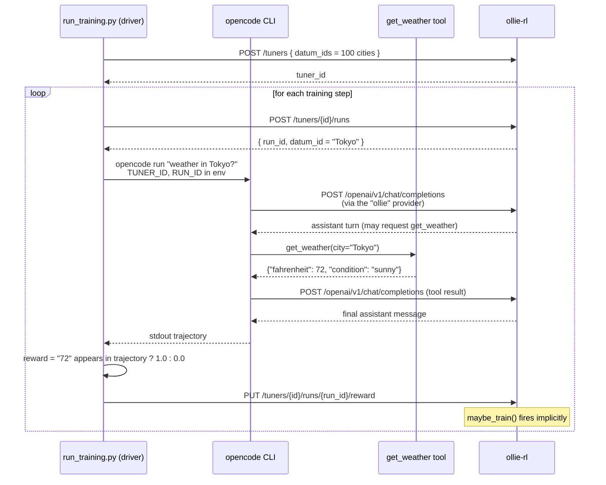

# Weather Agent — End-to-End OpenCode + ollie-rl Example

A tiny, completely self-contained training loop that demonstrates how an
**unmodified** [OpenCode](https://opencode.ai) agent can be fine-tuned by
`ollie-rl`. The agent answers questions like *"What is the weather in
Tokyo?"* by calling a deterministic **custom OpenCode tool**
(`get_weather`) that reads a static JSON file. The reward is `1.0` iff
the agent's final answer surfaces the correct Fahrenheit value.

```
examples/weather-agent/
├── .opencode/
│   └── tools/
│       └── get_weather.ts     ← Custom OpenCode tool (TypeScript)
├── data/
│   └── cities.json            ← 100 cities × {fahrenheit, condition}
├── opencode.json              ← Points OpenCode at ollie-rl
├── run_training.py            ← The driver (creates tuner, scores runs)
└── README.md
```

## How it fits together



## Prerequisites

1. **ollie-rl server** running on `http://localhost:8000`:

   ```bash
   # From the repo root
   uv sync
   uv run poe dev
   ```

2. **OpenCode CLI** on your `PATH`:

   ```bash
   curl -fsSL https://opencode.ai/install | bash
   opencode --version
   ```

   The driver invokes `opencode run --dangerously-skip-permissions` so the
   custom tool can execute without an interactive prompt.

3. **Python deps** for the driver (already in the repo's `pyproject.toml`):
   `httpx`.

## Run it

From the **repo root** (so that OpenCode discovers
`examples/weather-agent/.opencode/tools/get_weather.ts`):

```bash
uv run python examples/weather-agent/run_training.py --steps 200
```

You should see output like:

```
[driver] created tuner 9f3c… (100 cities)
[driver] step 0000 city='Tokyo'              expected=  72°F reward=1 avg32=1.000
[driver] step 0001 city='Madrid'             expected=  88°F reward=0 avg32=0.500
…
```

Every **16** scored runs of the same city form a GRPO group; every **32**
groups (= 512 runs) trigger a `train_step` on the configured trainer
backend automatically.

### Useful flags

| Flag                  | Default        | Meaning                                              |
|-----------------------|----------------|------------------------------------------------------|
| `--base-url`          | `http://localhost:8000` | ollie-rl HTTP base URL.                              |
| `--recipe`            | `grpo_16x32`   | Named recipe registered in the `Cookbook`.           |
| `--trainer`           | `fake`         | Trainer factory (`fake`, `tinker`, …).               |
| `--steps`             | `200`          | Number of run/score iterations.                      |
| `--opencode-timeout`  | `180`          | Per-`opencode run` hard timeout in seconds.          |
| `--tuner-id`          | *(none)*       | Resume scoring against an existing tuner.            |

## Reward

The reward function is intentionally trivial — it greps the trajectory
printed by `opencode run` for the expected Fahrenheit value of the
dispensed city (e.g. `72°F`, `72 F`, `72 Fahrenheit`). A run gets `1.0`
on a successful surface and `0.0` otherwise, including when the agent
hallucinated, refused to call the tool, or crashed.

This is meant as the *simplest possible* reward shape: enough to learn
"call `get_weather`, then echo the number back". You can extend it to
penalise wrong numbers, reward concise answers, etc.

## What the custom tool returns

The tool is deterministic about the underlying temperature, but
**randomises the unit it reports in** (~50/50 split between Fahrenheit
and Celsius). The agent therefore has to read the `unit` field and
convert to Fahrenheit when needed before answering — that conversion
*is* the skill being trained.

```jsonc
// Tool: get_weather(city="Tokyo")  — Fahrenheit branch (~50%)
{
  "city": "Tokyo",
  "temperature": 72,
  "unit": "°F",
  "condition": "sunny"
}

// Tool: get_weather(city="Tokyo")  — Celsius branch (~50%)
{
  "city": "Tokyo",
  "temperature": 22,
  "unit": "°C",
  "condition": "sunny"
}
```

The underlying data lives in [`data/cities.json`](./data/cities.json)
(stored in Fahrenheit). Regenerate with different temperatures by
editing that file — no other code changes needed.
